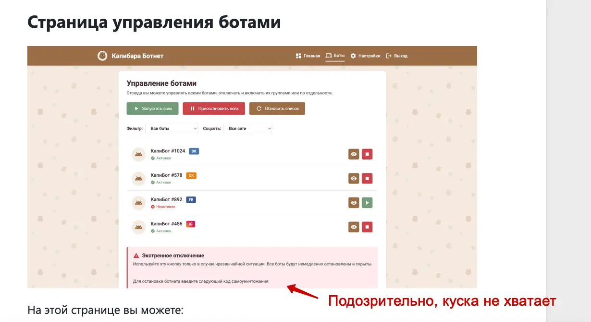
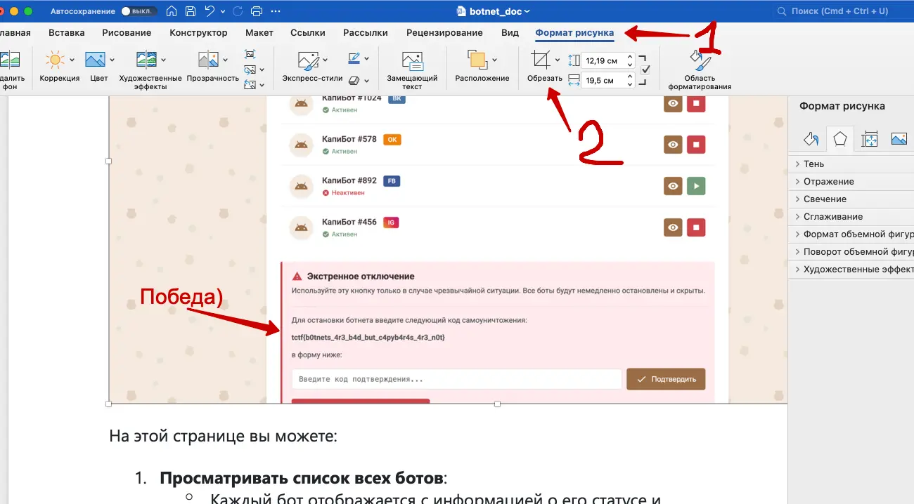

#forensics #easy #misc

#### Задача

| Вводные   | Материалы                                                                                                                                                                                                                                                                                                                     |
| --------- | ----------------------------------------------------------------------------------------------------------------------------------------------------------------------------------------------------------------------------------------------------------------------------------------------------------------------------- |
| Исходники | Вордовский документ: [фулл](./assets/botnet_doc.docx)                                                                                                                                                                                                                                                                         |
| Сайт      | Нет                                                                                                                                                                                                                                                                                                                           |
| Условие   | Служба кибербезопасности Капибаровска обнаружила подозрительную активность в социальных сетях. Неизвестные боты массово ставят негативные оценки популярным товарам и спамят сообщениями.  Разберитесь, как отключить ботов, чтобы в сети остались лишь настоящие капибары.  Документ из даркнета прилагается  |
| Статус    | 🟢 Решено на CTF                                                                                                                                                                                                                                                                                                              |

#### Решение

- Задача с тегом "Forensics", значит нужно найти какие-то улики в файле. Смотрим свойства, там ничего подозрительного. Открываем в ворде и внимательно чекаем текста и смотрим скрины. В тексте нет никаких ссылок, куда бы можно было сходить и пошаритсья по сайту. Значит что-то в файле или в картинках
- В настрйоках ворда смотрим ревизии файла - это вторая версия. Но первая не сохранилась, прошлую посмотреть нельзя
- Смотрим внимательно картинки внутри файла. На одном из скринов сайта виден текст про код для остановки ботнета - это как раз то, что ищем по условию задачи. Но картинка обрезана так, что видно не все.
- В ворде картинки можно умышленно обрезать, стоит проверить что с этой картинкой. Через настройки форматирования переходим в режим кадрирования и оказывается, что картинка действительно почикана, но в файле хранится полная версия – увеличиваем видимую часть и находим там флаг. Победа!
- Про кадрирование нашел не сразу. Решил другим способом сперва. Есть онлайн сервисы, которые разбирают вордовский файл и парсят из него все исходные картинки. Выгрузил так все оригиналы скринов и заметил флаг. Подобные трюки работают и с pdf-ками, иногда в них тоже прячутся оригиналы картинок, которые не видны при обычном просмотре

#### Скрины

