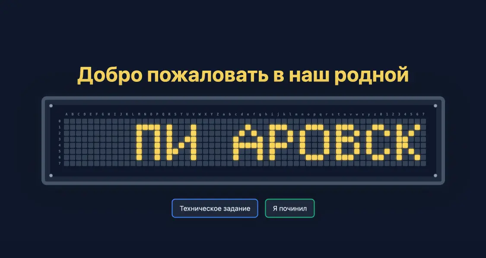
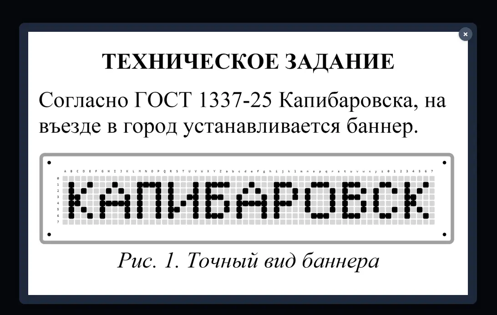
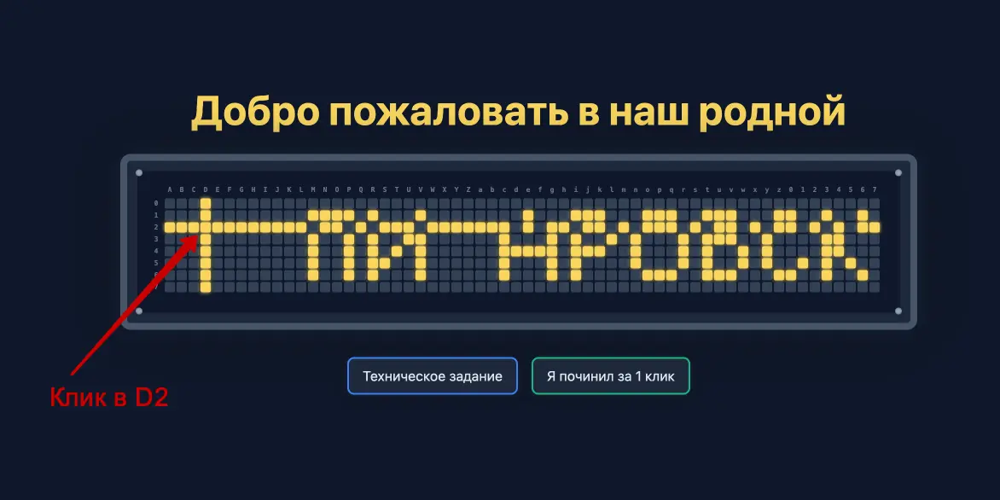

#easy #misc #coding #web

#### Задача

| Вводные   | Материалы                                                                                                                                                                                                                                             |
| --------- | ----------------------------------------------------------------------------------------------------------------------------------------------------------------------------------------------------------------------------------------------------- |
| Исходники | Нет                                                                                                                                                                                                                                                   |
| Сайт      | https://t-banner-f5nxn9hp.spbctf.org                                                                                                                                                                                                                  |
| Условие   | На въезде в город его гостей встречает большой капибаннер с горящей надписью «Добро пожаловать в Капибаровск!». Несколько букв перегорели, и теперь город переименовался в «пиаровск». Такой пиар ему точно не нужен — почините скорее буквы!<br><br> |
| Статус    | 🔴 Не решено. Алгоритм взят у другой команды после CTF                                                                                                                                                                                                |

#### Решение
- Потыкавшись на сайте, становится понятно, что обмануть сайт нельзя - ничего подсунуть в запрос не получается. Нужно решить головоломку: зажечь правильно табло с баннером. Логика похожа на игру [Lights Out](https://ru.wikipedia.org/wiki/Lights_Out_(%D0%B8%D0%B3%D1%80%D0%B0)) но с усложенением – при клике на клетку загорается/выключается весь ряд и вся строка, в которой находится нужный пиксель
- Руками накликать не получается, нужно писать алгоритм, который просчитает нужные ходы. И в идеале второй скрипт, который можно выполнить в браузере и само все прокликается
- Из кода страницы берем матрицу с исходным расположением пикселей на табло и матрицу ТЗ, к которой нужно придти. Эти данные пригодятся для написания алгоритма
- Сходу написать код не удалось, выпытать у нейронки тоже ничего внятного не удалось. Потрачено, задача не решена во время CTF. 

#### Код определения верных шагов

```js
const lights = [
	[0, 0, 0, 0, 0, 0, 0, 0, 0, 0, 0, 0, 0, 0, 0, 0, 0, 0, 0, 0, 0, 0, 0, 0, 0, 0, 0, 0, 0, 0, 0, 0, 0, 0, 0, 0, 0, 0, 0, 0, 0, 0, 0, 0, 0, 0, 0, 0, 0, 0, 0, 0, 0, 0, 0, 0, 0, 0, 0, 0,],
	[0, 0, 0, 0, 0, 0, 0, 0, 0, 0, 0, 0, 1, 1, 1, 1, 0, 1, 0, 0, 0, 1, 0, 0, 0, 0, 0, 0, 0, 0, 1, 0, 0, 0, 1, 1, 1, 0, 0, 0, 1, 1, 1, 0, 0, 1, 1, 1, 0, 0, 0, 1, 1, 0, 0, 1, 0, 0, 1, 0,],
	[0, 0, 0, 0, 0, 0, 0, 0, 0, 0, 0, 0, 1, 0, 0, 1, 0, 1, 0, 0, 0, 1, 0, 0, 0, 0, 0, 0, 0, 1, 0, 1, 0, 0, 1, 0, 0, 1, 0, 1, 0, 0, 0, 1, 0, 1, 0, 0, 1, 0, 1, 0, 0, 1, 0, 1, 0, 1, 0, 0,],
	[0, 0, 0, 0, 0, 0, 0, 0, 0, 0, 0, 0, 1, 0, 0, 1, 0, 1, 0, 0, 1, 1, 0, 0, 0, 0, 0, 0, 1, 0, 0, 0, 1, 0, 1, 0, 0, 1, 0, 1, 0, 0, 0, 1, 0, 1, 1, 1, 0, 0, 1, 0, 0, 0, 0, 1, 1, 0, 0, 0,],
	[0, 0, 0, 0, 0, 0, 0, 0, 0, 0, 0, 0, 1, 0, 0, 1, 0, 1, 0, 1, 0, 1, 0, 0, 0, 0, 0, 0, 1, 1, 1, 1, 1, 0, 1, 1, 1, 0, 0, 1, 0, 0, 0, 1, 0, 1, 0, 0, 1, 0, 1, 0, 0, 0, 0, 1, 1, 0, 0, 0,],
	[0, 0, 0, 0, 0, 0, 0, 0, 0, 0, 0, 0, 1, 0, 0, 1, 0, 1, 1, 0, 0, 1, 0, 0, 0, 0, 0, 0, 1, 0, 0, 0, 1, 0, 1, 0, 0, 0, 0, 1, 0, 0, 0, 1, 0, 1, 0, 0, 1, 0, 1, 0, 0, 1, 0, 1, 0, 1, 0, 0,],
	[0, 0, 0, 0, 0, 0, 0, 0, 0, 0, 0, 0, 1, 0, 0, 1, 0, 1, 0, 0, 0, 1, 0, 0, 0, 0, 0, 0, 1, 0, 0, 0, 1, 0, 1, 0, 0, 0, 0, 0, 1, 1, 1, 0, 0, 1, 1, 1, 0, 0, 0, 1, 1, 0, 0, 1, 0, 0, 1, 0,],
	[0, 0, 0, 0, 0, 0, 0, 0, 0, 0, 0, 0, 0, 0, 0, 0, 0, 0, 0, 0, 0, 0, 0, 0, 0, 0, 0, 0, 0, 0, 0, 0, 0, 0, 0, 0, 0, 0, 0, 0, 0, 0, 0, 0, 0, 0, 0, 0, 0, 0, 0, 0, 0, 0, 0, 0, 0, 0, 0, 0,],
];

const tz = [
	[0, 0, 0, 0, 0, 0, 0, 0, 0, 0, 0, 0, 0, 0, 0, 0, 0, 0, 0, 0, 0, 0, 0, 0, 0, 0, 0, 0, 0, 0, 0, 0, 0, 0, 0, 0, 0, 0, 0, 0, 0, 0, 0, 0, 0, 0, 0, 0, 0, 0, 0, 0, 0, 0, 0, 0, 0, 0, 0, 0,],
	[0, 1, 0, 0, 1, 0, 0, 0, 1, 0, 0, 0, 1, 1, 1, 1, 0, 1, 0, 0, 0, 1, 0, 1, 1, 1, 1, 0, 0, 0, 1, 0, 0, 0, 1, 1, 1, 0, 0, 0, 1, 1, 1, 0, 0, 1, 1, 1, 0, 0, 0, 1, 1, 0, 0, 1, 0, 0, 1, 0,],
	[0, 1, 0, 1, 0, 0, 0, 1, 0, 1, 0, 0, 1, 0, 0, 1, 0, 1, 0, 0, 0, 1, 0, 1, 0, 0, 0, 0, 0, 1, 0, 1, 0, 0, 1, 0, 0, 1, 0, 1, 0, 0, 0, 1, 0, 1, 0, 0, 1, 0, 1, 0, 0, 1, 0, 1, 0, 1, 0, 0,],
	[0, 1, 1, 0, 0, 0, 1, 0, 0, 0, 1, 0, 1, 0, 0, 1, 0, 1, 0, 0, 1, 1, 0, 1, 1, 1, 0, 0, 1, 0, 0, 0, 1, 0, 1, 0, 0, 1, 0, 1, 0, 0, 0, 1, 0, 1, 1, 1, 0, 0, 1, 0, 0, 0, 0, 1, 1, 0, 0, 0,],
	[0, 1, 1, 0, 0, 0, 1, 1, 1, 1, 1, 0, 1, 0, 0, 1, 0, 1, 0, 1, 0, 1, 0, 1, 0, 0, 1, 0, 1, 1, 1, 1, 1, 0, 1, 1, 1, 0, 0, 1, 0, 0, 0, 1, 0, 1, 0, 0, 1, 0, 1, 0, 0, 0, 0, 1, 1, 0, 0, 0,],
	[0, 1, 0, 1, 0, 0, 1, 0, 0, 0, 1, 0, 1, 0, 0, 1, 0, 1, 1, 0, 0, 1, 0, 1, 0, 0, 1, 0, 1, 0, 0, 0, 1, 0, 1, 0, 0, 0, 0, 1, 0, 0, 0, 1, 0, 1, 0, 0, 1, 0, 1, 0, 0, 1, 0, 1, 0, 1, 0, 0,],
	[0, 1, 0, 0, 1, 0, 1, 0, 0, 0, 1, 0, 1, 0, 0, 1, 0, 1, 0, 0, 0, 1, 0, 1, 1, 1, 0, 0, 1, 0, 0, 0, 1, 0, 1, 0, 0, 0, 0, 0, 1, 1, 1, 0, 0, 1, 1, 1, 0, 0, 0, 1, 1, 0, 0, 1, 0, 0, 1, 0,],
	[0, 0, 0, 0, 0, 0, 0, 0, 0, 0, 0, 0, 0, 0, 0, 0, 0, 0, 0, 0, 0, 0, 0, 0, 0, 0, 0, 0, 0, 0, 0, 0, 0, 0, 0, 0, 0, 0, 0, 0, 0, 0, 0, 0, 0, 0, 0, 0, 0, 0, 0, 0, 0, 0, 0, 0, 0, 0, 0, 0,],
];

const boardHeight = 8;
const boardWidth = 60;
const labelChars = [];

for (let i = 65; i <= 90; i++) { labelChars.push(String.fromCharCode(i)); } // A-Z
for (let i = 97; i <= 122; i++) { labelChars.push(String.fromCharCode(i)); } // a-z
for (let i = 0; i <= 7; i++) { labelChars.push(i.toString()); } // 0-7

const diff = [];
for (let r = 0; r < boardHeight; r++) {
	diff[r] = [];
	for (let c = 0; c < boardWidth; c++) {
		diff[r][c] = lights[r][c] ^ tz[r][c];
	}
}

const diffRowSum = Array(boardHeight).fill(0);
for (let r = 0; r < boardHeight; r++) {
	for (let c = 0; c < boardWidth; c++) {
		diffRowSum[r] ^= diff[r][c];
	}
}

const diffColSum = Array(boardWidth).fill(0);
for (let c = 0; c < boardWidth; c++) {
	for (let r = 0; r < boardHeight; r++) {
		diffColSum[c] ^= diff[r][c];
	}
}

const moves = [];
for (let r = 0; r < boardHeight; r++) {
	for (let c = 0; c < boardWidth; c++) {
		const clickNeeded = diff[r][c] ^ diffRowSum[r] ^ diffColSum[c];
		if (clickNeeded === 1) {
			const moveNotation = labelChars[c] + r.toString();
			moves.push(moveNotation);
		}
	}
}

console.log(moves.join(', '));
```

#### Код "прокликивания" пикселей

```js
async function setBanner() {
	const coordinatesToClick = [
		"Y0", "Z0", "a0", "A1", "C1", "D1", "F1", "G1", "H1", "J1", "K1", "L1",
		"M1", "N1", "O1", "P1", "Q1", "R1", "S1", "T1", "U1", "V1", "W1", "Y1",
		"Z1", "a1", "b1", "c1", "d1", "e1", "f1", "g1", "h1", "i1", "j1", "k1",
		"l1", "m1", "n1", "o1", "p1", "q1", "r1", "s1", "t1", "u1", "v1", "w1",
		"x1", "y1", "z1", "01", "11", "21", "31", "41", "51", "61", "71", "A2",
		"C2", "E2", "F2", "G2", "I2", "K2", "L2", "M2", "N2", "O2", "P2", "Q2",
		"R2", "S2", "T2", "U2", "V2", "W2", "b2", "c2", "d2", "e2", "f2", "g2",
		"h2", "i2", "j2", "k2", "l2", "m2", "n2", "o2", "p2", "q2", "r2", "s2",
		"t2", "u2", "v2", "w2", "x2", "y2", "z2", "02", "12", "22", "32", "42",
		"52", "62", "72", "A3", "D3", "E3", "F3", "H3", "I3", "J3", "L3", "M3",
		"N3", "O3", "P3", "Q3", "R3", "S3", "T3", "U3", "V3", "W3", "Y3", "Z3",
		"b3", "c3", "d3", "e3", "f3", "g3", "h3", "i3", "j3", "k3", "l3", "m3",
		"n3", "o3", "p3", "q3", "r3", "s3", "t3", "u3", "v3", "w3", "x3", "y3",
		"z3", "03", "13", "23", "33", "43", "53", "63", "73", "A4", "D4", "E4",
		"F4", "L4", "M4", "N4", "O4", "P4", "Q4", "R4", "S4", "T4", "U4", "V4",
		"W4", "a4", "b4", "c4", "d4", "e4", "f4", "g4", "h4", "i4", "j4", "k4",
		"l4", "m4", "n4", "o4", "p4", "q4", "r4", "s4", "t4", "u4", "v4", "w4",
		"x4", "y4", "z4", "04", "14", "24", "34", "44", "54", "64", "74", "B5",
		"D5", "G5", "K5", "X5", "Y5", "Z5", "A6", "C6", "D6", "F6", "H6", "I6",
		"J6", "L6", "M6", "N6", "O6", "P6", "Q6", "R6", "S6", "T6", "U6", "V6",
		"W6", "Y6", "Z6", "b6", "c6", "d6", "e6", "f6", "g6", "h6", "i6", "j6",
		"k6", "l6", "m6", "n6", "o6", "p6", "q6", "r6", "s6", "t6", "u6", "v6",
		"w6", "x6", "y6", "z6", "06", "16", "26", "36", "46", "56", "66", "76",
		"Y7", "Z7", "a7"
	];
	
	  
	
	const labelChars = [];
	for (let i = 65; i <= 90; i++) { labelChars.push(String.fromCharCode(i)); } // A-Z
	
	for (let i = 97; i <= 122; i++) { labelChars.push(String.fromCharCode(i)); } // a-z
	for (let i = 0; i <= 7; i++) { labelChars.push(i.toString()); } // 0-7
	
	function sleep(ms) {
		return new Promise(resolve => setTimeout(resolve, ms));
	}
	
	const delayBetweenClicks = 50; // Задержка в миллисекундах (можно изменить)
	console.log(`Начинаю кликать ${coordinatesToClick.length} раз...`);
	
	for (const coord of coordinatesToClick) {
		// Извлекаем метку колонки (буква/цифра) и номер строки
		const colLabel = coord.slice(0, -1); // Все символы кроме последнего		
		const row = coord.slice(-1); // Последний символ (номер строки)

		// Находим индекс колонки по метке		
		const col = labelChars.indexOf(colLabel);

		if (col === -1) {
			console.error(`Ошибка: Не удалось найти индекс для метки колонки "${colLabel}" в координате "${coord}"`);
			continue; // Пропускаем эту координату, если метка не найдена
		}

		// Формируем CSS-селектор для поиска нужного элемента "light"		
		const selector = `div.light[data-row="${row}"][data-col="${col}"]`;
		const lightElement = document.querySelector(selector);

		if (lightElement) {
			// Если элемент найден, симулируем клик
			lightElement.click();
			console.log(`Кликнули: ${coord} (row: ${row}, col: ${col})`);
			// Ждем немного перед следующим кликом
			await sleep(delayBetweenClicks);
		} else {
			// Если элемент не найден, выводим ошибку
			console.error(`Ошибка: Элемент не найден для координаты "${coord}" (селектор: ${selector})`);
		}
		
	}

	console.log("Все клики завершены!");
}

setBanner();
```
#### Скрины








