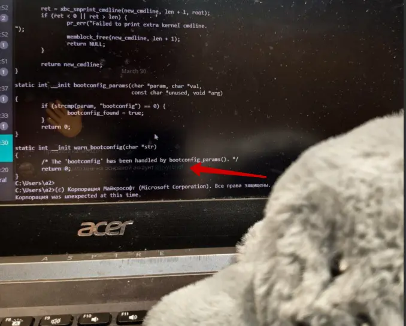
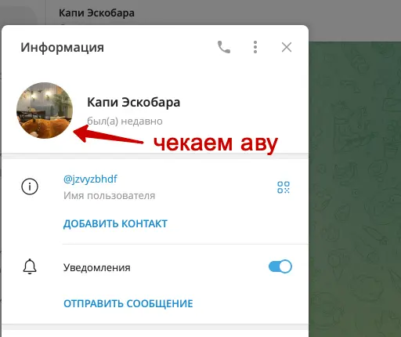
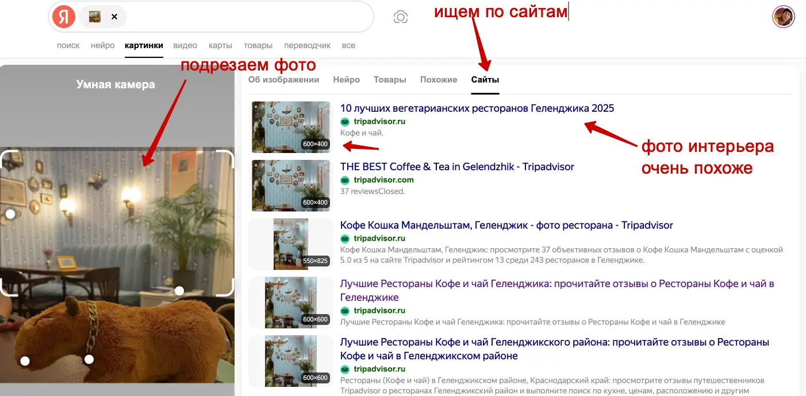

#easy #osint

#### Задача

| Вводные   | Материалы                                                                                                                                                                                                                                                                                                                                                                                                                                                                                                   |
| --------- | ----------------------------------------------------------------------------------------------------------------------------------------------------------------------------------------------------------------------------------------------------------------------------------------------------------------------------------------------------------------------------------------------------------------------------------------------------------------------------------------------------------- |
| Исходники | Без исходников                                                                                                                                                                                                                                                                                                                                                                                                                                                                                              |
| Сайт      | Без сайта                                                                                                                                                                                                                                                                                                                                                                                                                                                                                                   |
| Условие   | В городе повальное увлечение капибадами — их принимают, чтобы наладить режим сна, для блестящей шерстки и игривого настроения.  Но не все производители добросовестные, и на рынке много опасных предложений. Дилер расфасовывает бады у себя в подвале, в составе может оказаться что угодно.  Последний раз объявление о продаже низкопробных капибадов видели на торговой площадке «КапиПродай».  Вычислите место, где регулярно бывает дилер, и вызовите туда наряд капилиции   |

#### Решение
- Задача осинтовская – нужно проводить расследование. Кроме описания задачи, ничего больше нет. Нужно сдать координаты места, где чаще всего бывает преступник
- Идем в поиск гугла и яндекса: гуглим "Капибады" и "КапиПродай". Гуглим в том числе и в ковычках, чтобы гуглилась конкретная словоформа, в случае с несколькими словами будет искать именно такое вхождение, где слова идет в токой де последовательности. Находим сайт КапиПродай
- На сайте есть объявление о Капибадах, но оно уже заблокировано и нет никакой информации о продавце. Если объявление сейчас снято, то раньше оно могло висеть опубликованным. Значит нужно проверить старые версии сайта. Идем на вебархив и смотрим там, какие есть "слепки сайта" за прошлые даты: https://web.archive.org
- В вебархиве открываем старую версию, там объявление полное и из него находим группу в телеге: @capybady
- В группе телеграмма есть фотки фейковых отзывов и на одной из фоток в отражении экрана виден тг-аккаунт. Идем туда: @jzvyzbhdf
- Нашелся аккаунт самого продавца. По аватарке аккаунта ищем место через яндекс.картинки. Находится кафе "Кофе Кошка Мандельштам" в Геленджике. 
- Гуглим координаты этого кафе и сдаем их в задачу - победа!

#### Скрины

