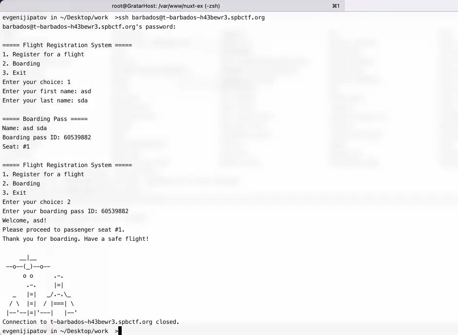
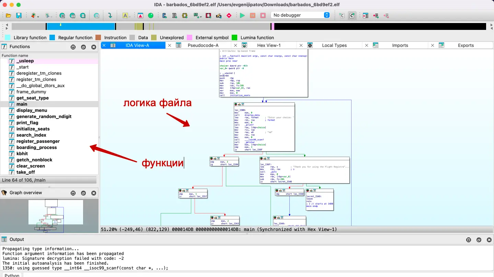
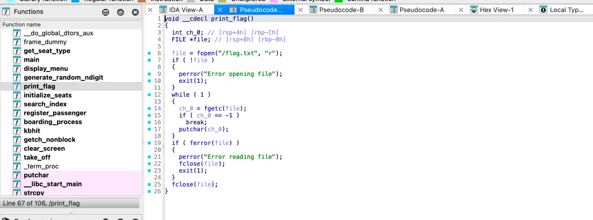
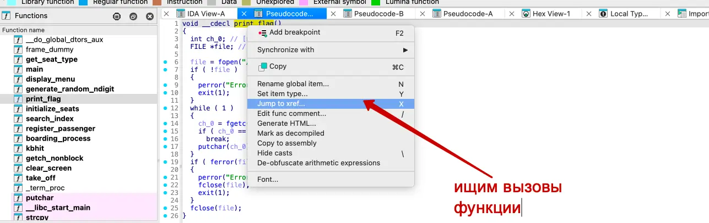
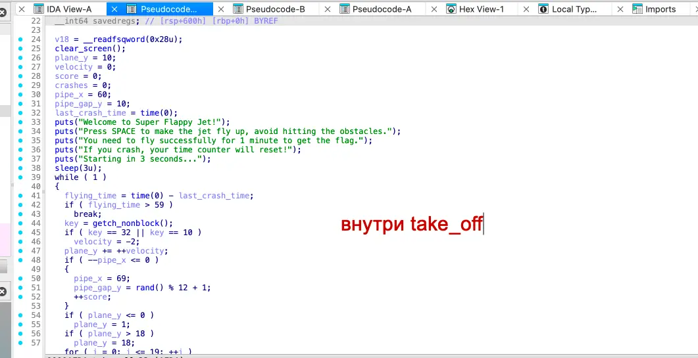
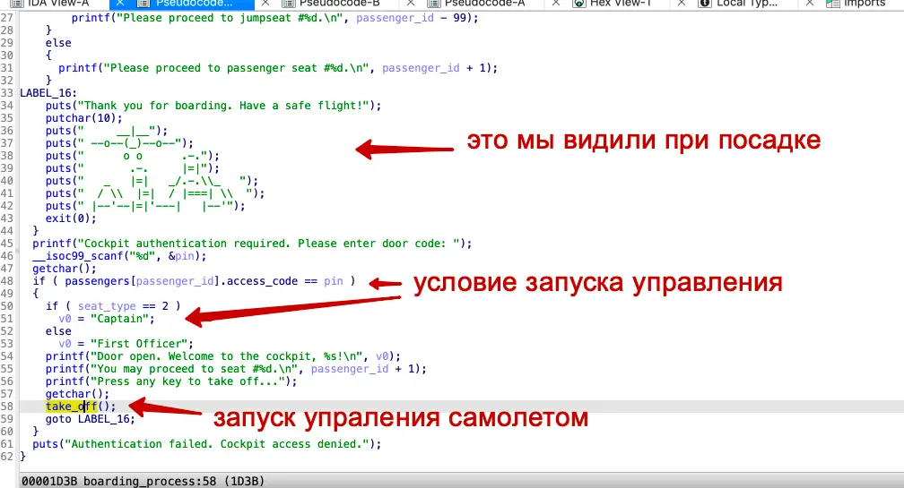
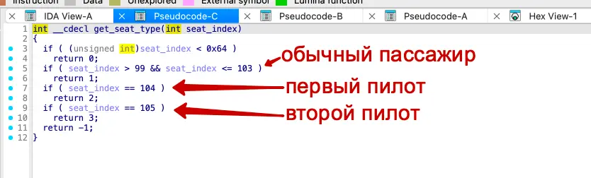
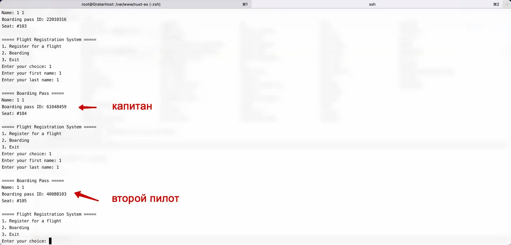
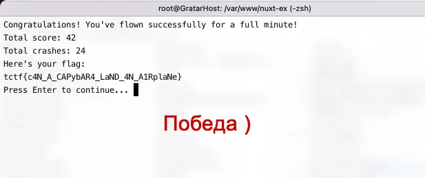

#medium #reverse #pwn

#### Задача

| Вводные   | Материалы                                                                                                                                                                                                                                                                                                                                                                                                                                        |
| --------- | ------------------------------------------------------------------------------------------------------------------------------------------------------------------------------------------------------------------------------------------------------------------------------------------------------------------------------------------------------------------------------------------------------------------------------------------------ |
| Исходники | Бинарник elf: [barbados.elf](./assets/barbados.elf)                                                                                                                                                                                                                                                                                                                                                                                              |
| Сайт      | Нет                                                                                                                                                                                                                                                                                                                                                                                                                                              |
| Условие   | Крупная авиакомпания запустила скидки на полеты на Капибарбадос. Радостные капибары запланировали отпуска и уже представили себя на белоснежном пляже. Но компания продала больше билетов, чем мест в самолете — и теперь сто капибар не могут улететь.  Пора взять дело в свои руки и увезти всех в отпуск.  **`ssh t-barbados-h43bewr3.spbctf.org`**   `Username:` **`barbados`**   `Password:` **`z8JGUwJzCnkbLXZYHPS0PA`** |
| Статус    | 🟢 Решено на CTF                                                                                                                                                                                                                                                                                                                                                                                                                                 |

#### Решение

- По задаче у нас есть файл с расширением elf и доступ по ssh к серваку. Заходим на сервер и осматриваемся. Нам доступно три варианта действий: регистрация на рейс, посадка в самолет и выход. Пробуем - регистрируемся и в ответ получаем посадочный id и номер места. Пробуем пройти посадку, после нее закрывается соединение. Флага нет, намеков где его искать тоже нет.   
- Тег pwn в связке с reverse говорят о том, что реверсить придется именно бинарник, а не что-то обфусцированное или другой какой-то файл. Тут у нас в задаче есть elf – это линуксовый бинарник исполняемого файла. Значит в нем есть какая-то логика, такое лучше всего разбирается через IDA. Открываем файл и смотрим.
- Сходу открывается ассемблеровские хексы и функции, а также схема работы приложения. Так же виден набор функций. Смотрим, что есть на схеме - явных намеком на вывод флага нет. И блок-схема с хексами ничего очевидного не показывает. Среди функций есть print_flag, похоже на то, что нам нужно. 
- В асме сложно что-то прочесть, поэтому перекомпилируем асм в псевдо-код си, нажав F5, так попонятнее немного. В функции печати флага видим чтение флага из файла flag.txt и вывод текста. То, что нужно. Но нет никаких пояснений, как вызвать эту функцию - ищем ее вызовы. Вызов только один, внутри функции take_off. Но тут код какой-то странный, нет ничего, что мы видили в консоле. Судя по выводу в консоль, нам нужно минуту управлять самолетом, никуда не врезаться и тогда нам дадут флаг. Уже немного понятнее, что нужно сделать - завладеть управлением самолета, но все еще не понятно как этого добиться.
- Ищем теперь вызовы функции управления самолетом take_off. Находим вызов в внутри функции boarding_process - тут уже знакомые куски из консоли стали попадаться. Из кода функции понимаем, что нам нужно при посадке на самолет получить для пассажира seat_type == 2, чтобы стать пилотом. seat_type определяется в функции get_seat_type(int seat_index),  где seat_index - это номер при регистрации, которые выдаются просот по порядку.
- Из кода get_seat_type понимаем, что для первых 103 регистраций даются права пассажиров, для 104-го выдается роль капитана, а для 105 роль второго пилота.
- Теперь все, что остается сделать, это порегать 104 пользователя и подняться на борт под id 104-го. Тогда нам дадут роль капитана и возможность получить флаг после управления самолетом
- Можно написать скрипт, который автоматом порегает 104 пользователя, но заготовок не было и можно было провозиться дольше, чем за пару минут руками протыкать 104 раза. Открываем консоль и вперед, регаемся 104 раза.
- Как и предполагали из кода, 104 пассажир стал капитанам и нас перекинуло на новую ветку логики – запустилась на минуту игра Flappy Bird, только в консоле. Нужно в течении минуты тыкать пробел и не врезаться никуда самолетом, иначе все с начала. Я разбился больше 20 раз пока прошел игру)) Но по успешному завершению был получен флаг. Победа! 
- Видос полета есть в конце страницы под скринами.

#### Скрины

