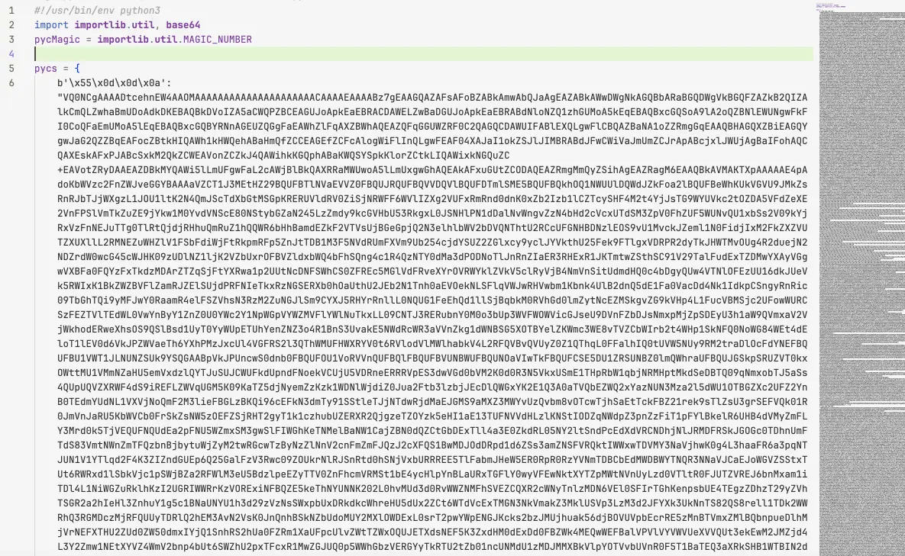
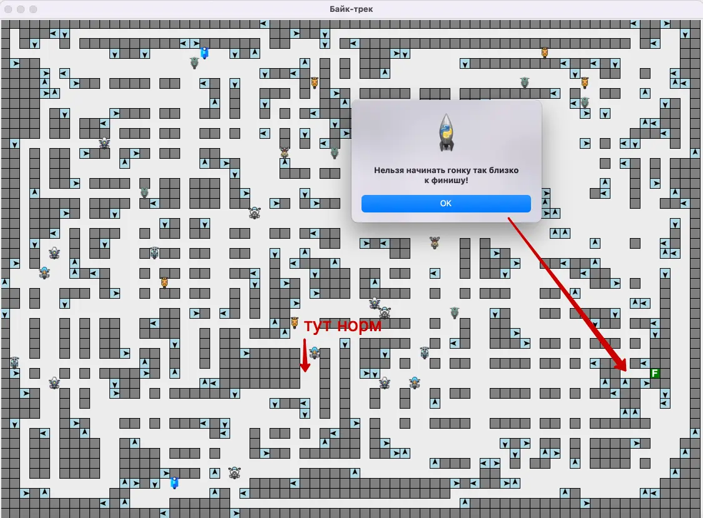
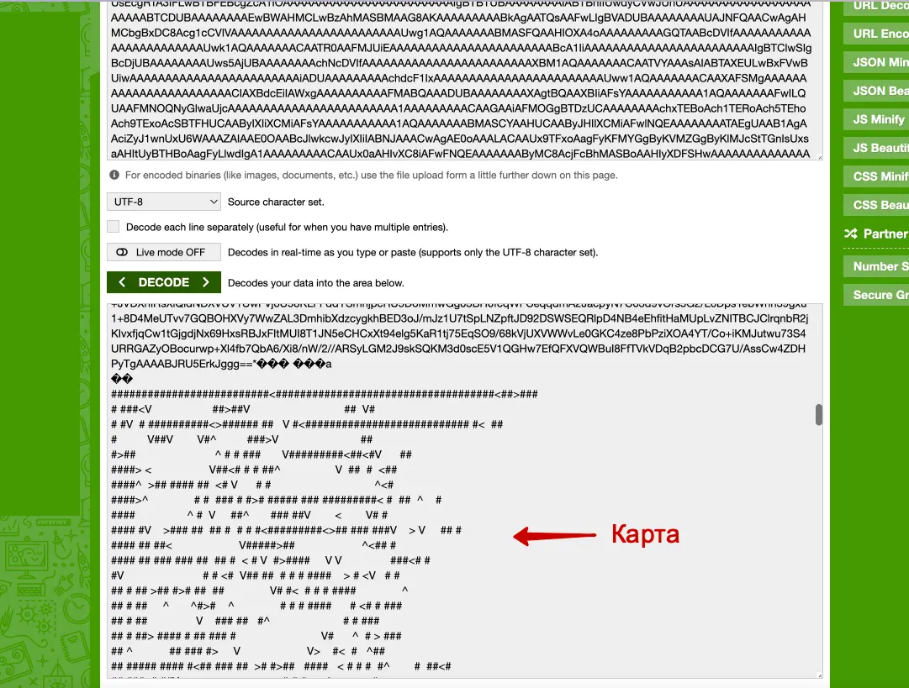
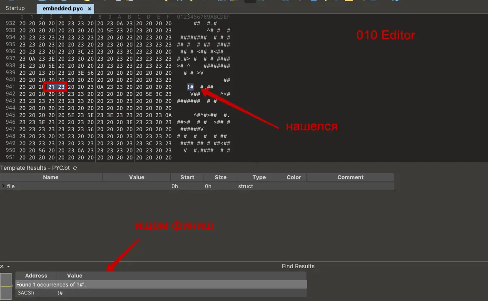
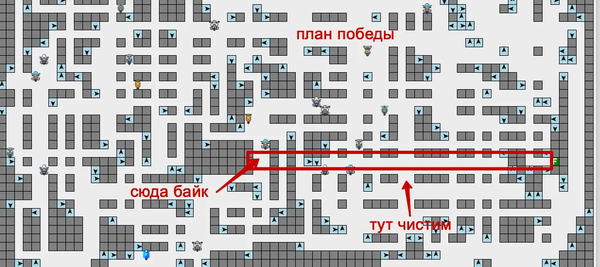
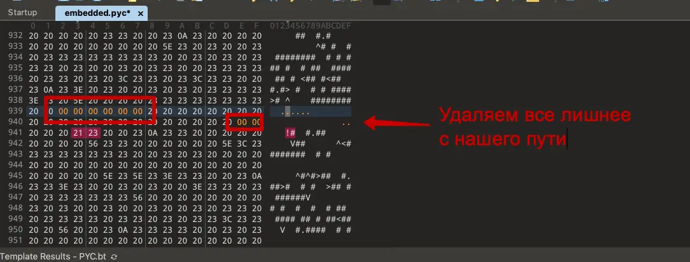
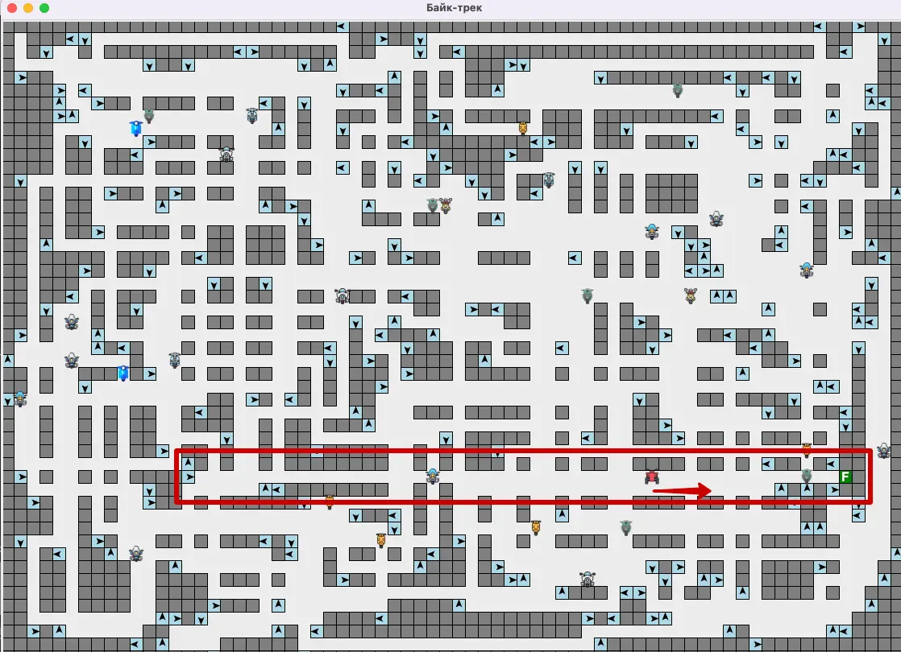
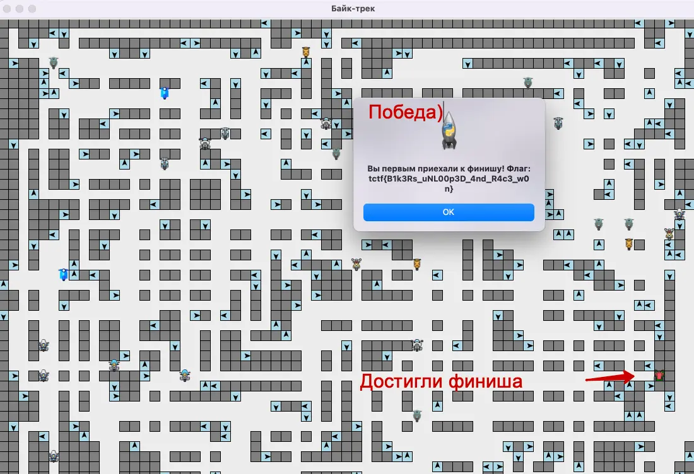

#medium #reverse #python

#### Задача

| Вводные   | Материалы                                                                                                                                                                                                                                                      |
| --------- | -------------------------------------------------------------------------------------------------------------------------------------------------------------------------------------------------------------------------------------------------------------- |
| Исходники | Исходник игры: [bike_track.py](./assets/bike_track.py)                                                                                                                                                                                                         |
| Сайт      | Нет                                                                                                                                                                                                                                                            |
| Условие   | Капибайкерский клуб решил устроить мотопробег и подал схему его маршрута в мэрию. Но в компьютере произошел сбой, и маршрут зациклился.  Капибайкеры уже несколько часов ездят по кругу и сильно шумят. Почините схему, чтобы пробег наконец закончился. |
| Статус    | 🟢 Решено на CTF                                                                                                                                                                                                                                               |

#### Решение

- Смотрим исходник, который у нас есть - файл на питоне, который импортирует какие-то библиотеки, далее месево из не читаемого байт-кода, и в конце весь этот байт-код записывается в embedded.pyc и он уже запускается
- Ничего не понятно, пробуем запустить скрипт. Сыпятся ошибки на нехватку библиотек, нагугливаем их, ставим и запускаем снова. Кроме установки библиотек, проблем с запуском нет. Стартует приложение с игрой: карта со стенами, по которой катаются байки, бьются в стены и рандомно разворачиваются, пытаясь доехать до точки финиша с текстом F.  Перед стартом гонок, мы можем установить свой мотоцикл и так же отправить ее рандомно кататься. Судя по всему, наша цель доехать до финиша первым, тогда получим флаг, наверное. 
- Есть несколько сложностей с победой: точка финиша расположена так, что к ней никогда не доедет ни один байк. А ставить байк рядом с финишем нельзя, игра это запрещает. Получается, нужно или отредактировать условие, которое запрещает ставить байк рядом с финишем или отредактировать карту так, чтобы наш мотоцикл проехал по прямой к финишу и ни во что не врезался
- Пытаемся декожировать байт-код. Какие-то куски похожи на base64, и если раскодировать его, то видна карта. Пример на скрине ниже
- Покрутив разные варианты через base64, ничего путного не вышло, кроме как сломать байт-код и игра совсем перестала запускаться.
- Откатываемся обратно и с чистого листа снова компилируем код. При компиляции байткод записывается в файл embedded.pyc – это уже бинарник, скомпилированный питоновский скрипт. Его можно разобрать каким-нибдуь декомпилятором или HEX-редакторов. Пробуем IDA – набор хексов непонятных, логики не видно. Пробуем 101 Editor - тут уже попонятнее, можно найти куски карты, которые раньше приходилось вычленять из base64. 
- Находим финиш и пробуем по прямой расчистить карту для нашего байка. Меняем стены на пустые байты - 00 00. Скрины ниже
- После того, как отредактированы хексы в карте, сохраяем бинарник и перезапускаем игру. Стартуем по прямой и добиаемся до финиша - игра выдает нам флаг. Победа!

#### Скрины

