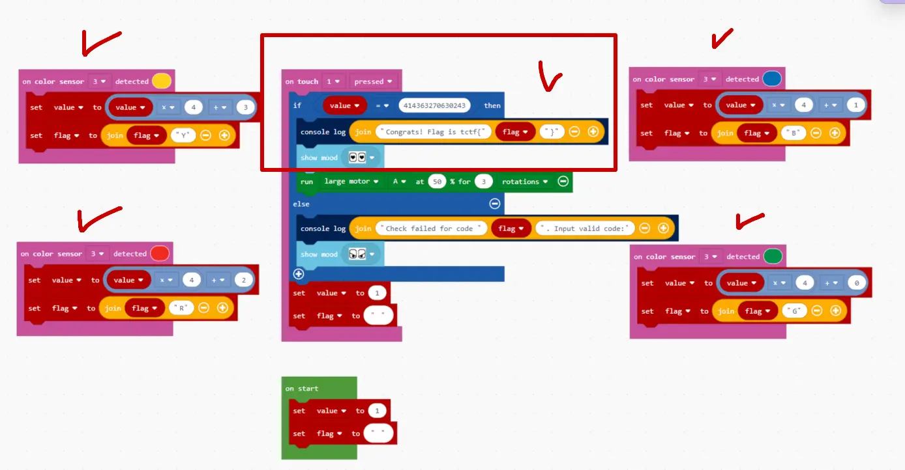
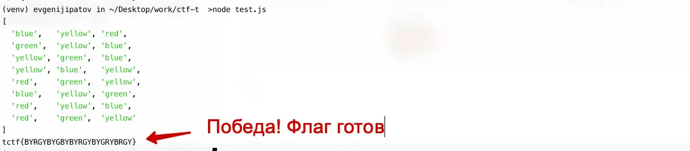

#easy #reverse

#### Задача

| Вводные   | Материалы                                                                                                                                                                                                                                                                                                 |
| --------- | --------------------------------------------------------------------------------------------------------------------------------------------------------------------------------------------------------------------------------------------------------------------------------------------------------- |
| Исходники | Картинка для дешефрации: [фулл](barca.png)                                                                                                                                                                                                                                                                |
| Сайт      | Нет                                                                                                                                                                                                                                                                                                       |
| Условие   | Футбольный клуб Капибаровска готовится к самой важной игре сезона. Сегодня последняя тренировка перед матчем. Но соперники решили ее сорвать — и заблокировали все шкафчики Капибарсы. Взломайте кодовые замки и достаньте капибарам их счастливые бутсы.<br><br>Внутреннее устройство замков на картинке |
| Статус    | 🟢 Решено на CTF                                                                                                                                                                                                                                                                                          |

#### Решение
- На исходной картинки изображена схема в Scratch и замок. На схеме есть несколько лишних блоков для запутывания. Определяем только нужные - их пять. Четыре схемы, которые по очереди вызываются и увеличивают числовой счетчик. Пятая схема проверяет, что число достигло значения 414363270630243. А так же каждый вызов схемы с увеличеничем счетчика, в другую переменную добавляется буква. 
- Нужно побегать по схемам так, чтобы счетчик достиг значения 414363270630243 и при каждом действии добавлять во вторую переменную по букве, чтобы получился флаг.
- Если присмотреться к четырем схемам, которые увеличивают счетчик, то видно, что все они умножают исходное число на четыре и плюсуют значение от 0 до 3
- "Руками" можно долго умножать, логичнее запилить скрипт, который будет нужное число 414363270630243 делить на 4 и смотреть на остаток от деления - этот огрызок будет определять какую из 4х схем мы вызвали(там плюсуются от 0 до 3, как раз это остаток от целочисленного деления). 
- Пишем скрипт и получаем флаг

#### Код для высчитывания флага

```js
function reverseBarca(value) {
	let sequence = [], flagChars = [];
	while (value > 1) {
		let remainder = value % 4;
		switch(remainder) {
			case 0:
				sequence.unshift('green'); flagChars.unshift('G');
				break;
			case 1:
				sequence.unshift('blue'); flagChars.unshift('B');
				break;
			case 2:
				sequence.unshift('red'); flagChars.unshift('R');
				break;
			case 3:
				sequence.unshift('yellow'); flagChars.unshift('Y');
				break;
		}
		value = Math.floor((value - remainder) / 4);
	}
	return {sequence, flagChars};
}

const targetValue = 414363270630243;
const solution = reverseBarca(targetValue);
console.log(solution.sequence);
console.log(`tctf{${solution.flagChars.join('')}}`);
```

#### Скрины




