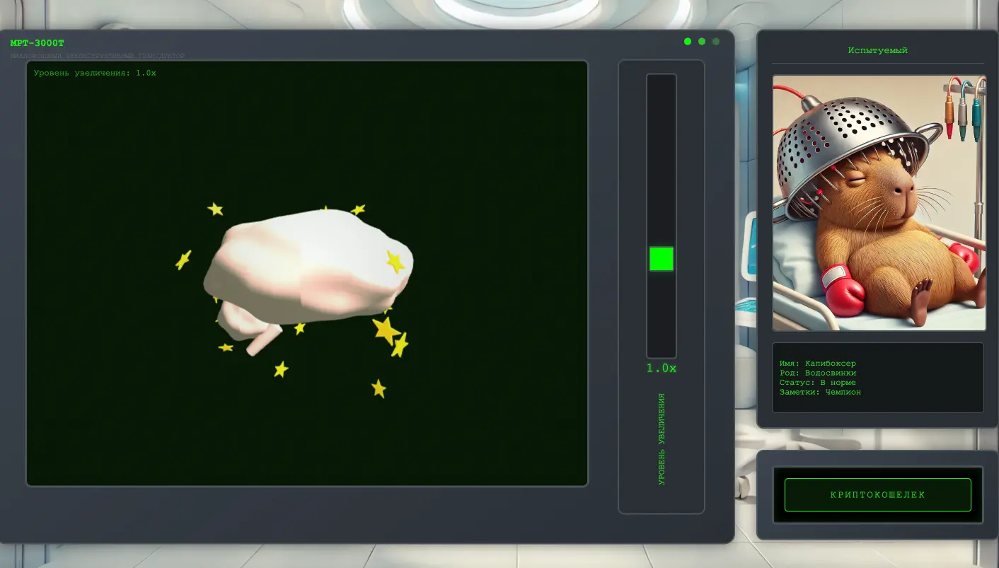
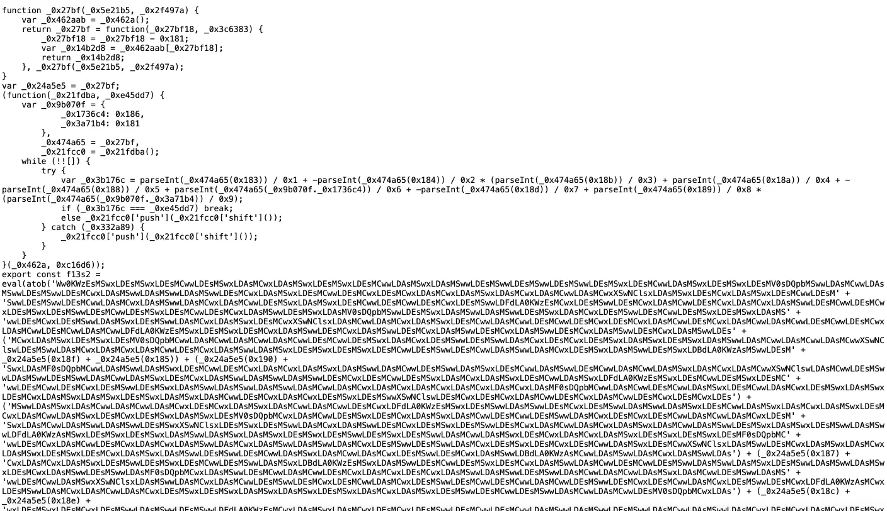
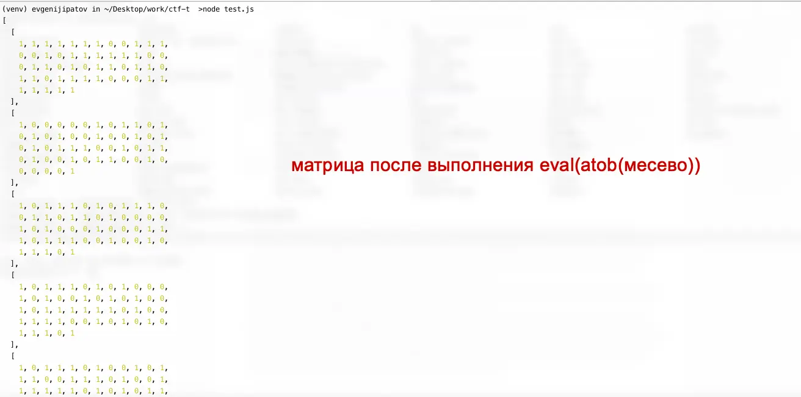
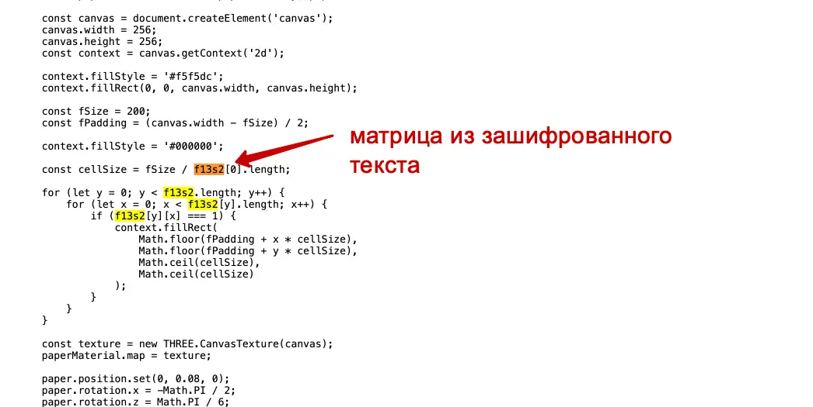
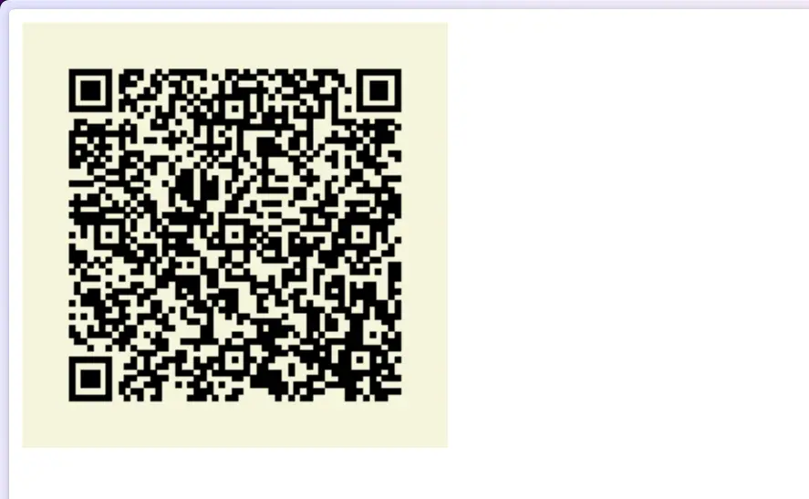
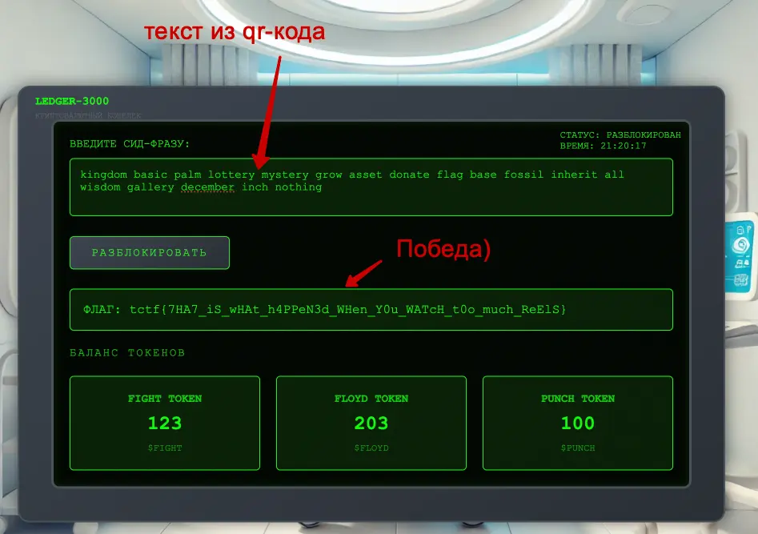

#easy #reverse #web #misc 

#### Задача

| Вводные   | Материалы                                                                                                                                                                                                                                                                |
| --------- | ------------------------------------------------------------------------------------------------------------------------------------------------------------------------------------------------------------------------------------------------------------------------ |
| Исходники | Нет                                                                                                                                                                                                                                                                      |
| Сайт      | https://t-boxing-i7g5wg26.spbctf.org/                                                                                                                                                                                                                                    |
| Условие   | Известный боксёр получил нокаут в последнем бою, после чего забыл, где хранится его пароль от криптокошелька. А курс капикоина сегодня взлетел! Выудите пароль из глубин его бессознательного, чтобы боксёр смог выгодно продать свои коины и утешиться после поражения. |
| Статус    | 🟢 Решено на CTF                                                                                                                                                                                                                                                         |

#### Решение
- На сайте МРТ мозга отображается - интерактивная 3D-модель крутится. Никаких запросов не отправляется, скрытых данных по исходникам не видно. Но нужно найти зашифрованную фразу, за которую выдадут флаг. У задачи метка reverse, поэтому кроме как внутри 3d-модели, искать больше негде.
- Лезем в исходники js и ищем подключение файла модели. Самой модели не нашлось, но есть ипморт обфусцированного кода brain_fog.js
- В коде мешанина из обфусцированных методов и кусков текста в base64. Но в итоге все это собирается, конвертируется в строку через atob и выполняется с помощью eval. Смысла разбираться в хексах и бейс64 нет, достаточно выполнить итоговый eval и проверить ответ. Запускаем код и получаем матрицу
- Получившаяся матрица состоит из нулей и единиц - это или бинарный код какой-то зашифрован или пиксели. Чтобы стало понятней, проверяем, куда экспортируется результат всего этого зашифрованного месева.
- Оказывается, что матрица используется на листе canvas, причем в 2D, а не в 3D, которая крутится на сайте. Видимо какой-то рисунок генерируется, но не отображается или спрятан за другими объектами 3D. 
- В тупую выдираем из сайта кусок логики для отрисовки 2D холста в canvas и переносим на свою статичную html, чтобы запустить и посмотреть, что там рисуется. 
- В канвасе отрисовывается QR-код из ранее найденной матрицы еденичек и нулей. Сканируем кувыркод и получаем вшитую в него текстовую фразу. Этот текст и есть ключ к получения флага - победа!

#### Скрины

