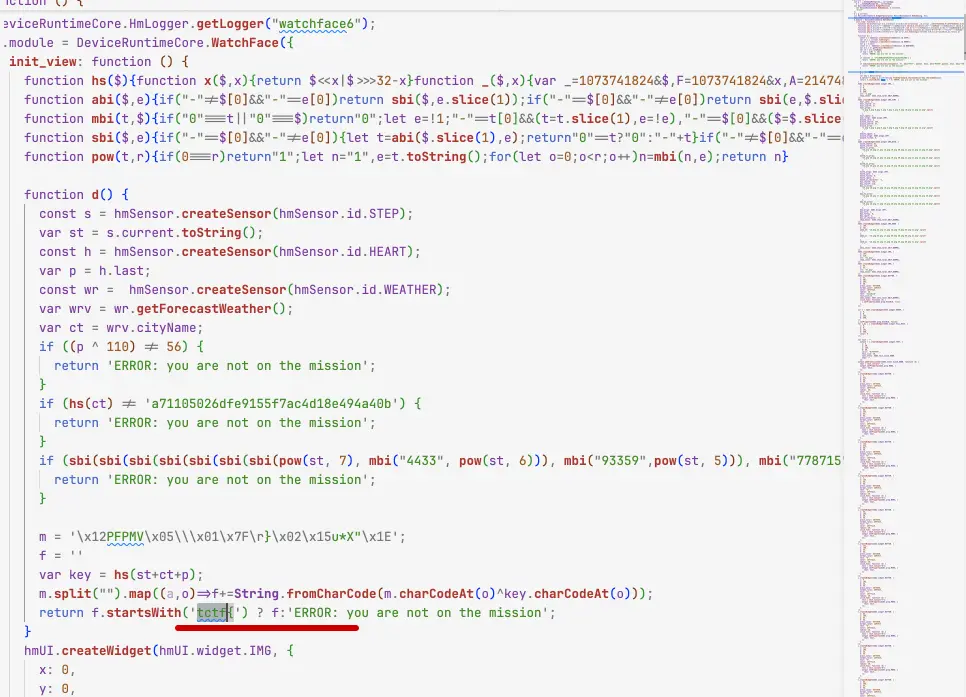
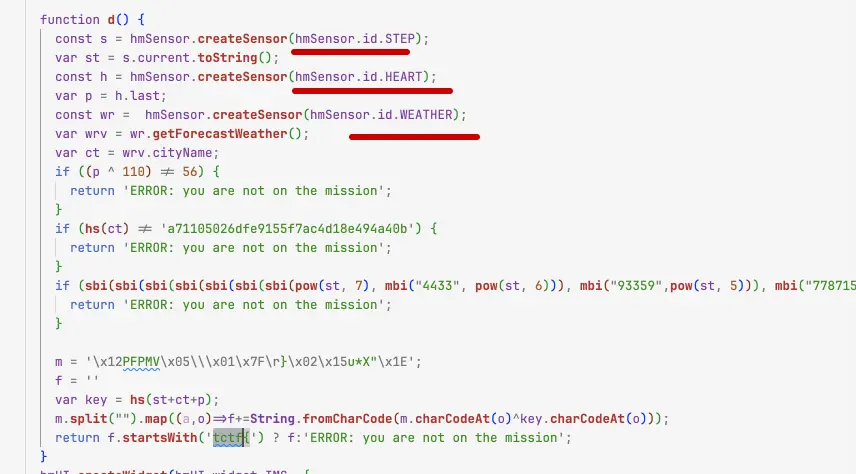
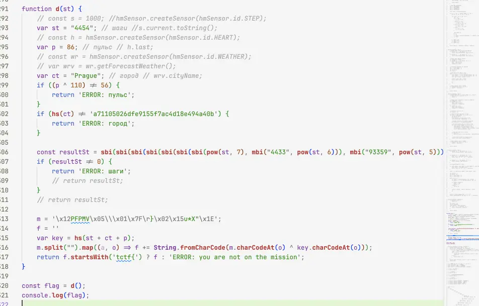
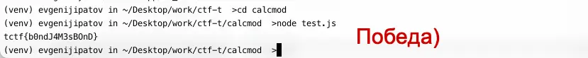

#medium #reverse 

#### Задача

| Вводные   | Материалы                                                                                                                                                                                                                                                                                                                                                                                     |
| --------- | --------------------------------------------------------------------------------------------------------------------------------------------------------------------------------------------------------------------------------------------------------------------------------------------------------------------------------------------------------------------------------------------- |
| Исходники | Исходник приложения на часы: [bond_113ee6a.tar](./assets/bond_113ee6a.tar)                                                                                                                                                                                                                                                                                                                    |
| Сайт      | Нет                                                                                                                                                                                                                                                                                                                                                                                           |
| Условие   | Помимо капилиции за порядком в Капибаровске следит Капибонд. В его арсенале шпионские часы: они умеют строить подземные маршруты, находить лазейки в охранных системах и сканировать отпечатки пальцев с улик.  Недавно Бонд прибыл на важную миссию, но часы подвели: отказались показывать секретное задание. Разберитесь в устройстве часов, чтобы помочь Бонду узнать детали миссии |
| Статус    | 🟢 Решено на CTF                                                                                                                                                                                                                                                                                                                                                                              |

#### Решение

- Кроме архива исходников приложения больше ничего нет, смотрим что внутри архива. Находим папку с ассетами - скипаем, файл с джейсом - там настройки приложения, пока откладываем. И два файла с js. Интересное находим в index.js - там есть упоминание флага(f.startsWith('tctf{') ? f:), но большая часть кода закодирована, а некоторые функции обфусцированны - получить f пока не понятно как. Но понятно, что нужно распутать все вызовы функций и сгенерить флаг
- Чистим лишний код, а короткие обфусцированные функции прогоняем нейронкой, чтобы она пояснила или попыталась перевести в читаемый вид код.
- Становится понятно, что функции это замороченные математические действия со строками, возведение степеней и расчет md5. Через все эти функции нужно прогнать три значения с сенсеров часов, чтобы пройти условие и получить верный флаг. По именам сенсеров становится понятно, что это шаги, пульс и название города.
- Пульс сходу просчитывает нейронка - условие пройдет число 86. Дальше нейросеть тупит и надо разбираться самому.
- Город должен проходить по md5 a71105026dfe9155f7ac4d18e494a40b, этот хеш гуглится и соответсвует Prague
- Остаются только шаги,  с ними уже сложее - число переводится в строку и прогоняется через десяток функций возведения в степень и еще каки-то непонятных обфусцированных действий. 
- Тут выручит брутфорс. Просто по порядку прогоняем число от 1 и более, пока не проскочит условие - вызываем просто в коде нужную функцию, а на ответ вешаем true|false. Таким способом высчитываем и валидные шаги - 4454.
- Теперь используя все известные параметры с датчика пульса, запускаем полную логику и получаем флаг. Победа!

#### Скрины

