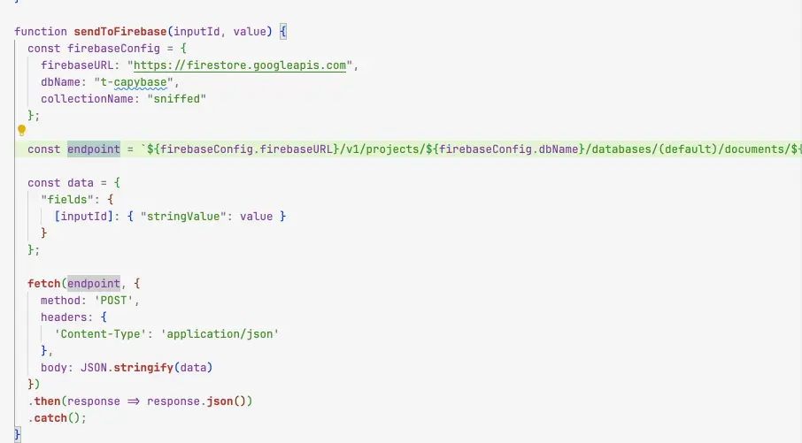
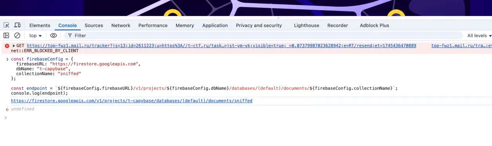
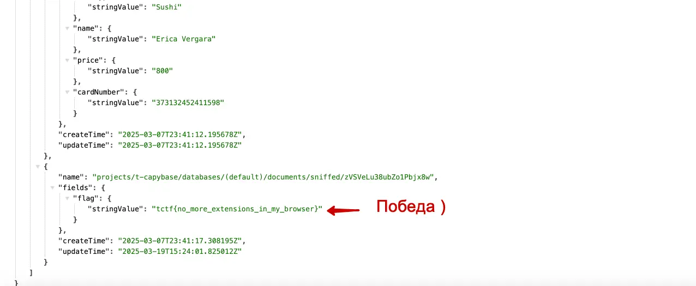

#easy #web #infra

#### Задача

| Вводные   | Материалы                                                                                                                                                                                                                                                      |
| --------- | -------------------------------------------------------------------------------------------------------------------------------------------------------------------------------------------------------------------------------------------------------------- |
| Исходники | Исходники расширения: [архив](./assets/capbaza_extension.zip)                                                                                                                                                                                                  |
| Сайт      | Нет                                                                                                                                                                                                                                                            |
| Условие   | В сеть слили капибазу популярного сервиса доставки еды. Теперь многим капибарам очень стыдно за то, сколько они всего съели, а некоторые, наоборот, завидуют другим.  Разберитесь, как произошла утечка. Кто сколько жует — личное дело каждого!   |
| Статус    | 🟢 Решено на CTF                                                                                                                                                                                                                                               |

#### Решение

- Распаковываем архив с расширением и смотрим содержимое. Судя по файлам это расширение для хрома. 
- Пролезаем файлы с логикой(.js) и смотрим содержимое - нет ничего зашифрованного и самого флага тоже нет. Значит надо искать эндпоинты, к которым обращается апиха, просто поиском по файлам или руками ищем fetch
- Находится запрос к firebase. И тут же формирование всей строки с доступами
- База в расширении запрашивается методом POST, но может быть и get-ом доступна, сперва открываем ее в браузере по полной ссылке. Сама ссылка формируется из кучи кусков и конфига – лень было ее собирать руками и просто в консоле браузера вызывал конкатенацию, чтобы получить полный адрес БД
- База открылась и GET-ом, а внутри уже оказался флаг. Победа!

#### Скрины

