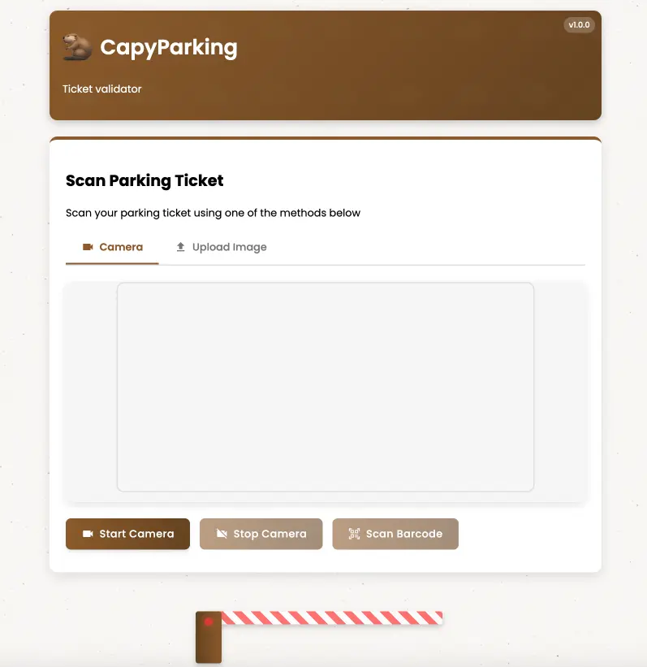
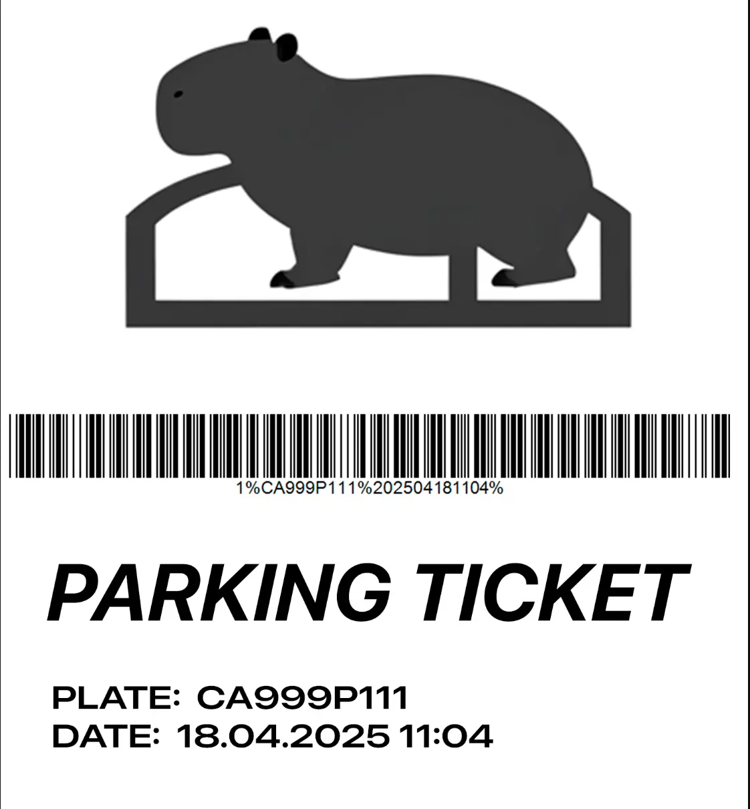
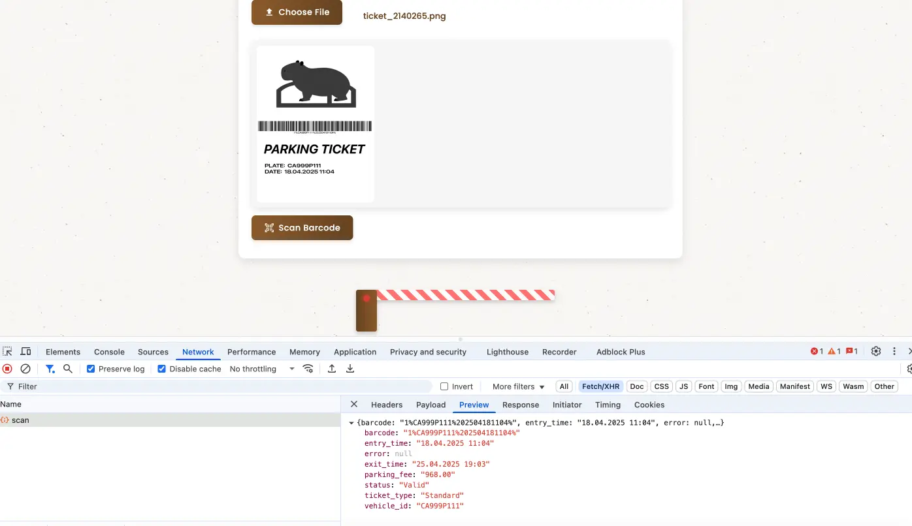
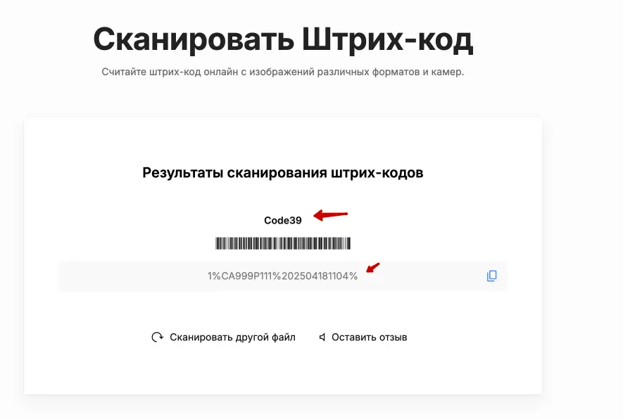
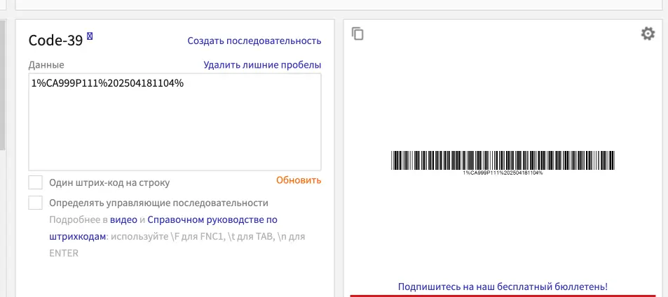
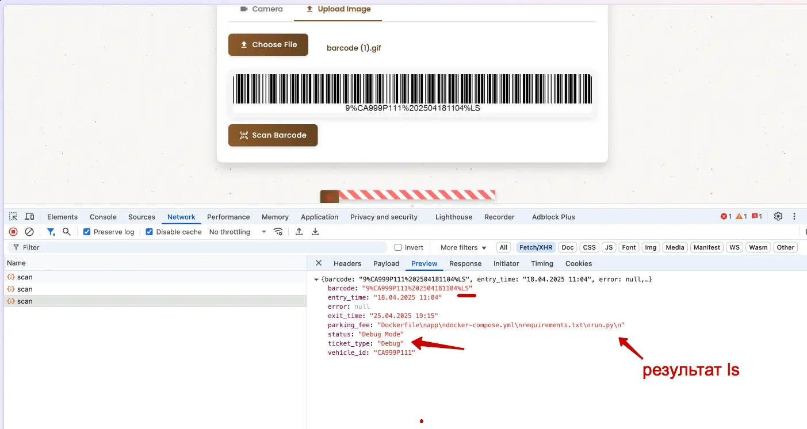
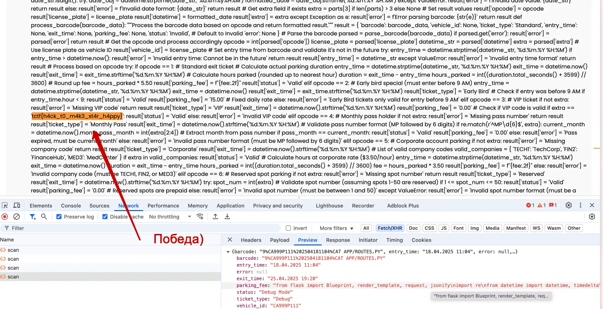

#medium  #web #debug

#### Задача

| Вводные   | Материалы                                                                                                                                                                                                                                                                                                                                                  |
| --------- | ---------------------------------------------------------------------------------------------------------------------------------------------------------------------------------------------------------------------------------------------------------------------------------------------------------------------------------------------------------- |
| Исходники | Картинка с билетом на паркинг: [ticket_2140265.png](./assets/ticket_2140265.png)                                                                                                                                                                                                                                                                           |
| Сайт      | https://t-parking-oeoxo2np.spbctf.org/                                                                                                                                                                                                                                                                                                                     |
| Условие   | Вы в главном паркинге Капибаровска! Здесь оставляют машины все — от поп-звезд до работников местных заведений.  Свое выступление сегодня планирует звезда мирового масштаба — Capi B, и она очень не любит ждать. Её водитель потерял талончик, с которым они въезжали, и единственное что у него есть — талончик, который кто-то обронил рядом.  |
| Статус    | 🟢 Решено на CTF                                                                                                                                                                                                                                                                                                                                           |

#### Решение

- Заходим на сайт и осматриваемся - есть только одно поле для загрузки файла, билета от парковки. Больше ничего интересного нет. Смотрим билет - картинка, штрихкод с подписью и текст под ней. 
- Чекаем картинку на личие EXIF-данных, там пусто. Смотрим свойства, там тоже ничего интересного, внутри самого файла так же ничего лишнего нет - просто картинка. 
- Пробуем залить ее на сайте и получаем ответ сервака, что это талон стандартного типа, и еще несколько полей с инфой о талоне, в том чиле и текстом под штриходом: 1%CA999P111%202504181104% 
- Пробуем замазать картинку и удалить с нее все, кроме штрихкода - заливаем опять на сайт и ответ точно такой же. Значит сервак считывает именно штрихкод. 
- Пробуем выяснить, что это за штрихкод и по какому стандарту он генерируется: через онлайн сканеры штрихкодов можно попробовать найти описание формата. Первый же онлайн сканер считал картинку и определил тип штрихкода как Code39.
- Гуглим про этот формат штрихкода: Code 39 – штрихкодовое обозначение, которым можно закодировать большие латинские буквы (от A до Z), цифры (от 0 до 9) и некоторые специальные символы.
- Теперь ищем онлайн-генератор таких штрихкодов. В нем генерим картинку с текстом, который был на исходом билете: 1%CA999P111%202504181104%. Сгенерированный штрихкод проходит на сайте и выдает точно такую же инфу, что и исходный билет. Значит все ок, можно эксперементировать дальше - менять значения в строке, генерить штрихкод и смотреть что происходит
- Методом проб и ошибок определяем, что строка в штрихкоде состоит из четырех значений: тип-билета % просто текст % дата и время начала билета % опции билета
- Опции билета в исходном штрих-кода пустые, но их можно дописывать.
- Дебаг продолжается и удается найти, что штрихкоды бывают 9 разных опций: стандартный, вип, утренний и тд. Тип определяется первым числом от 1 до 9. Самый интересный оказался тип 9 - он переводит сервер в режим дебага. В этом режиме сервер отвечает на пустые опции ошибкой "Отсутствует команда". Пробуем подсунуть команду ls и в ответ получаем список файлов с сервера.
- По списку файлов становится понятно, что бекенд на питоне. Чтобы дальше было проще действовать, стоит посмотреть что лежит в файлах самого бекенда. Начинаем run.py, там видим что он запускает бекенд из папки app. 
- Проверяем что лежит в app/routes.py с помощью штрихкода с командой: 9%CA999P111%202504181104%CAT APP/ROUTES.PY
- В ответ нам отдается весь код файла, а в нем уже и флаг, дальше никуда лезть не нужно. Победа!

#### Скрины

