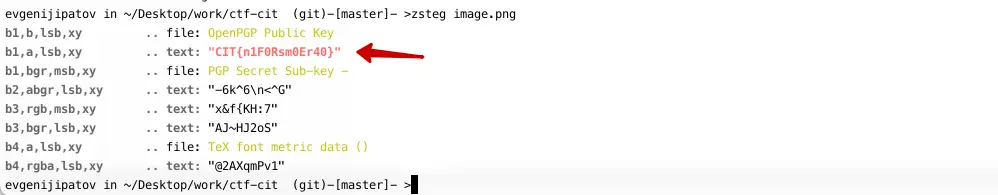

#### Картинки

[exiftool](https://github.com/exiftool/exiftool) – чтение EXIF-данных из картинок


[zsteg](https://github.com/zed-0xff/zsteg) – поиск скрытого текста внутри png и bmp картинок, анализирует не используемые байты в разных слоях



strings – проверить все строковые значения внутри файла
```
strings -n 5 -t x image.png
```
Где -n 5 - это минимальная длина строки, которую нужно вывести


file – проверить заголовки файла, чтобы определить что это такое, не обращая внимание на расширение 
```
> file image.png
image.png: PNG image data, 8 x 17, 8-bit/color RGBA, non-interlaced
```


#### Звук

[Audacity](https://www.audacityteam.org/) – приложение для анализа зашифрованных звуковых дорожек, есть спектрограмма для анализа частот. Визуализирует звуковые данные 


