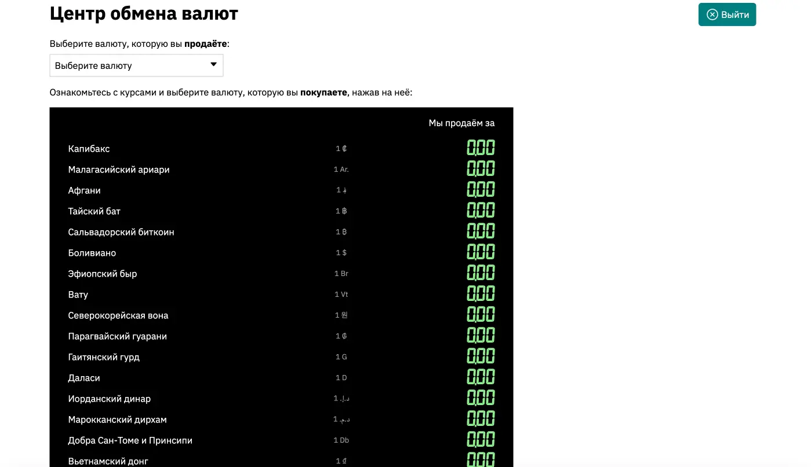
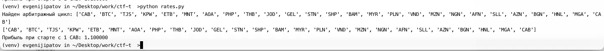

#medium #web #finance #coding 
#### Задача

| Вводные   | Материалы                                                                                                                                                                                                                                                                                                                      |
| --------- | ------------------------------------------------------------------------------------------------------------------------------------------------------------------------------------------------------------------------------------------------------------------------------------------------------------------------------ |
| Исходники | Исходники расширения: [архив](./assets/bucks.tar.gz)                                                                                                                                                                                                                                                                           |
| Сайт      | https://t-bucks-37jqk0ki.spbctf.org/                                                                                                                                                                                                                                                                                           |
| Условие   | На табло всех пунктов обмена валют Капибаровска произошел сбой. Они показывают курс один к одному, а счастливые капибары стоят в очередях, чтобы закупиться капибаксами. Доступ к настройке табло распространяется строго среди сотрудников обменных пунктов. Разбогатейте и откройте свой пункт, чтобы исправить курсы валют. |
| Статус    | 🟢 Решено на CTF                                                                                                                                                                                                                                                                                                               |

#### Решение

- На сайте мы начинаем с балансом 100 капибаксов. Имеем возможность менять эти капибаксы на любую из 50 валют. Но курс обмена не известен. После обмена на любую другую валюту ее можно так же обменивать на другие валюты и обратно на капибаксы. Наша задача так обменять валюту, чтоы в итоге из 100 капибаксов получилось 13337.
- Гадать и руками подбирать курс бесполезно, лезем в исходники. В исходниках задачи питоновский бекенд сайта, но с вырезанным массивом курсов валют. Однако, в коде есть массив со всеми ключами валют и описание открытой апи, которая по коду валюты отдает обменные курсы для этой валюты на каждую другую. Смотрим, какие курсы и понимаем, что каждая валюта по-разному меняется на другие 50 штук.
- С помощью эндпоинта с курсами валют собираем удаленный из кода массив со всеми обменными курсами.
- Имея все обменные курсы остается только найти правильный маршрут обмена и накрутить себе денег. Но данных очень много - 50 валют и каждая на каждую может меняться. Простым перебором не работает, скрипт виснит наглухо и очень долго считает. Нейронка тоже ничего внятного запилить не смогла. Пришлось гуглить алгоритмы поисков. Нашелся алгоритм Беллмана-Форда, который строит дерево и бегая по ребрам ищет самый оптимальный путь. Зная название алгоритма, нейронку уже проще было застаивть написать что-то внятное, помогая ей с помощью написания отдельных кусков.
- Когда был найден маршрут обмена, приводящий к 10% прибыли, все что осталось, это написать циклические запросы к сайту и гонять обмен, пока не наберется нужная сумма. Скрипт можно написать в консиле браузера - это проще всего, но тут уже все было на питоне и зарпосы тоже на нем организовал. Нужно было только с браузера взять свою куку и с ней слать запросы, чтобы начислилось моему пользователю.
- 2 минуты дудоса и на счету нужная сумма. Победа!


#### Исходники

Скрипт сбора всех обменных курсов:

```python
BASE_URL = "https://t-bucks-2arzsh9x.spbctf.org"

def fetch_rates(currency_code: CurrencyCode) -> list:
	response = requests.get(f"{BASE_URL}/currency/{currency_code.value}")
	if response.status_code != 200:
		raise Exception(f"Ошибка запроса для {currency_code}: {response.status_code}")
	data = response.json()
	return data["rates"]

def build_rates_matrix() -> list[list[float | None]]:
	size = len(CURRENCIES)
	rates = [[None for _ in range(size)] for _ in range(size)]
	for currency_code in CURRENCIES:
		index = CURRENCIES[currency_code].index
		rates[index] = fetch_rates(currency_code)
	return rates
	
def main():
	try:
		RATES = build_rates_matrix()
		print("RATES = [")
		for row in RATES:
			print(f" {row},")
			print("]")
			
		with open("rates.py", "w") as f:
			f.write("RATES = [\n")
			for row in RATES:
				f.write(f" {row},\n")
				f.write("]\n")
		
	except Exception as e:
		print(f"Ошибка: {e}")

if __name__ == "__main__":
	main()
```

Скрипт поиска 

```python
# Преобразование исходных данных в граф с логарифмическими весами
graph = {}
for i, currency_from in enumerate(currencies):
	graph[currency_from] = {}
	for j, currency_to in enumerate(currencies):
		if rates[i][j] is not None:
			graph[currency_from][currency_to] = -math.log(rates[i][j])

# Алгоритм Беллмана-Форда для поиска арбитражного цикла
def bellman_ford(graph, start):
	distance = {node: float('inf') for node in graph}
	predecessor = {node: None for node in graph}
	distance[start] = 0
	
	# Расслабление рёбер n-1 раз
	for _ in range(len(graph) - 1):
		for u in graph:
			for v in graph[u]:
				new_distance = distance[u] + graph[u][v]
				if new_distance < distance[v]:
					distance[v] = new_distance
					predecessor[v] = u
	
	# Поиск отрицательных циклов
	for u in graph:
		for v in graph[u]:
			if distance[u] + graph[u][v] < distance[v]:
				# Восстанавливаем путь начиная с начальной валюты
				current = start
				cycle = []
				visited = set()
				while True:
					cycle.append(current)
					next_node = predecessor.get(current)
					if next_node is None or next_node in visited:
						break
					visited.add(current)
					current = next_node
				# Теперь добавляем последний узел (замыкание цикла)
				cycle.append(start)
				return list(reversed(cycle)) # выводим цикл в правильном порядке
		return None

# Начинаем с валюты "CAB"
start_currency = "CAB"
cycle = bellman_ford(graph, start_currency)

if cycle:
	print("Найден арбитражный цикл:", cycle)
	# Расчёт прибыльности прохождения цикла
	amount = 1.0
	for i in range(len(cycle)-1):
		curr_from = cycle[i]
		curr_to = cycle[i+1]
		idx_from = currencies.index(curr_from)
		idx_to = currencies.index(curr_to)
		rate = rates[idx_from][idx_to]
		amount *= rate
	print(f"Прибыль при старте с 1 {start_currency}: {amount:.6f}")
else:
	print("Арбитражный цикл не найден")
```

Скрипт дудоса сайта, чтобы накрутить денег с помощью множества обменов:

```python
# Последовательность валют для обмена
currencies = ['CAB', 'BTC', 'TJS', 'KPW', 'ETB', 'MNT', 'AOA', 'PHP', 'THB', 'JOD', 'GEL', 'STN', 'SHP', 'BAM', 'MYR', 'PLN', 'VND', 'MZN', 'NGN', 'AFN', 'SLL', 'AZN', 'BGN', 'HNL', 'MGA', 'CAB']

# Исходная сумма
initial_amount = 100
# цель
target_amount = 14000

# Текущие параметры
current_amount = initial_amount
current_currency = currencies[0]

# Наши cookie
session_cookie = "__cfduid=1cfe1111ad134c1ea124b20543b5b8b3; session=eyJ1c2VyX2lkIjogIjNkOGVkNGVmMmIyYmYyODMzYmE2ZmZiMzQ3MWEyZjZjIiwgImJhbGFuY2VzIjogWzEwMCwgMCwgMCwgMCwgMCwgMCwgMCwgMCwgMCwgMCwgMCwgMCwgMCwgMCwgMCwgMCwgMCwgMCwgMCwgMCwgMCwgMCwgMCwgMCwgMCwgMCwgMCwgMCwgMCwgMCwgMCwgMCwgMCwgMCwgMCwgMCwgMCwgMCwgMCwgMCwgMCwgMCwgMCwgMCwgMCwgMCwgMCwgMCwgMCwgMF19.aAOu9Q.6LiX_FpIMf1uuymqa8144xDWzEM"

def get_balance(currency):
	headers = {"Cookie": session_cookie}
	response = requests.get(f"https://t-bucks-2arzsh9x.spbctf.org/currency/{currency}", headers=headers)
	if response.status_code != 200:
		raise Exception(f"Ошибка: {response.status_code}")
	balance = response.json()['balance']
	print(f"balance: {balance} {currency}")
	return balance

  

# Функция для выполнения обмена

def perform_exchange(source_currency, target_currency, amount):
	headers = {
		"Content-Type": "application/x-www-form-urlencoded",
		"Cookie": session_cookie
	}
	body = f"source_currency={source_currency}&target_currency={target_currency}&amount={amount}"
	response = requests.post("https://t-bucks-2arzsh9x.spbctf.org/exchange", headers=headers, data=body)
	if response.status_code == 400:
		raise Exception(f"Ошибка: {response.status_code}")

# Основной цикл обмена
while current_amount < target_amount:
	next_currency = currencies[(currencies.index(current_currency) + 1) % len(currencies)]
	perform_exchange(current_currency, next_currency, current_amount)
	new_balance = get_balance(next_currency)
	current_amount = new_balance
	current_currency = next_currency
	print(f"Обмен {current_amount} {current_currency}. Осталось заработать ещё {target_amount - current_amount} CAB.")

print("\nФинальный результат:")
print(f"Сумма: {current_amount} {current_currency}")
```

#### Скрины




