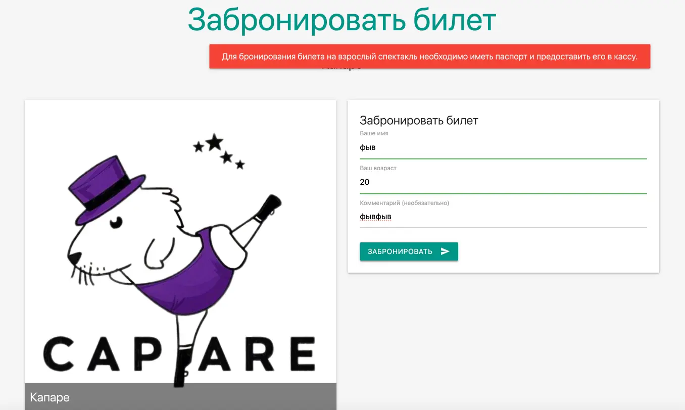
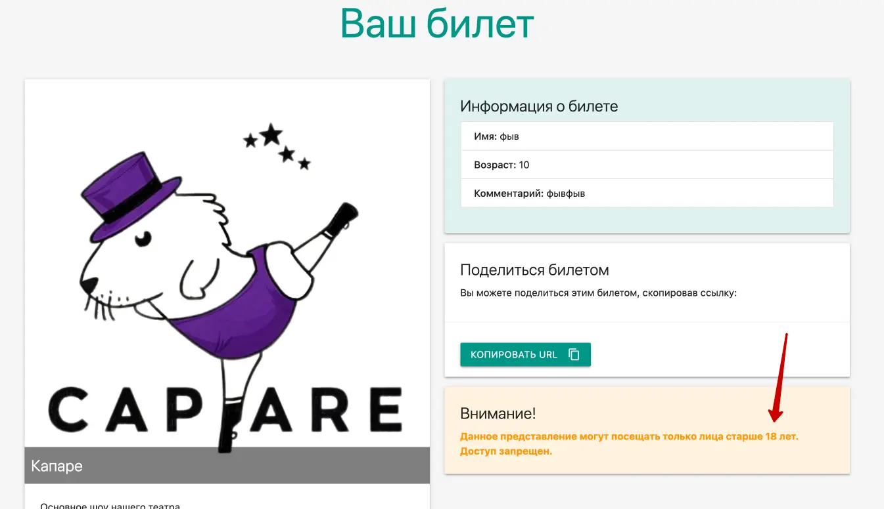
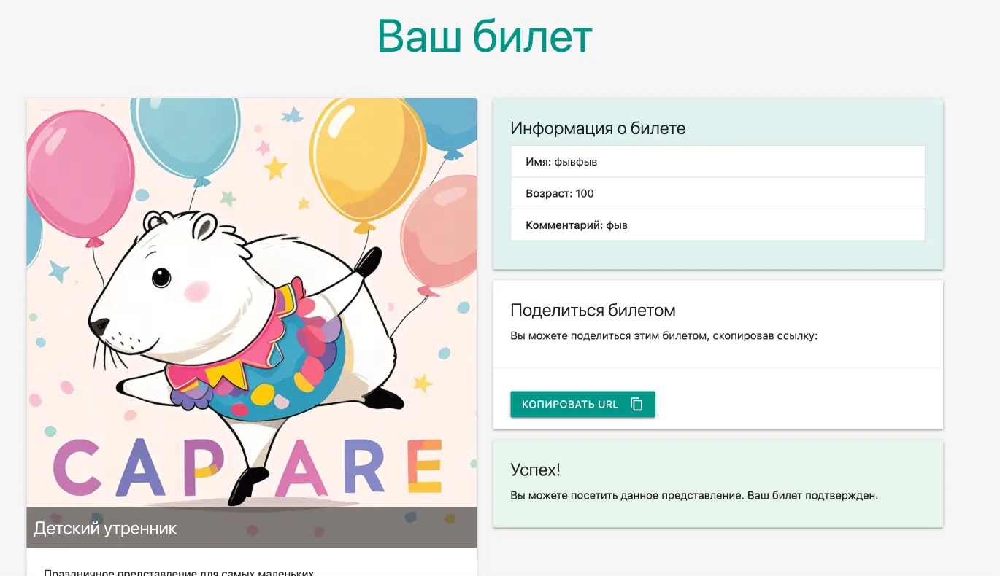
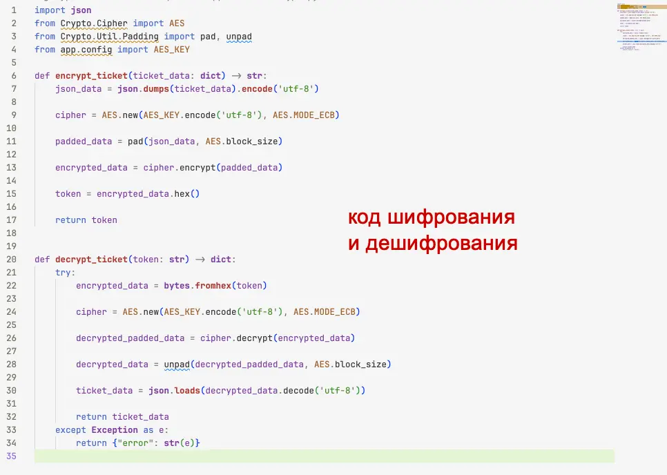
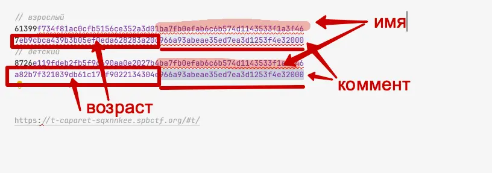
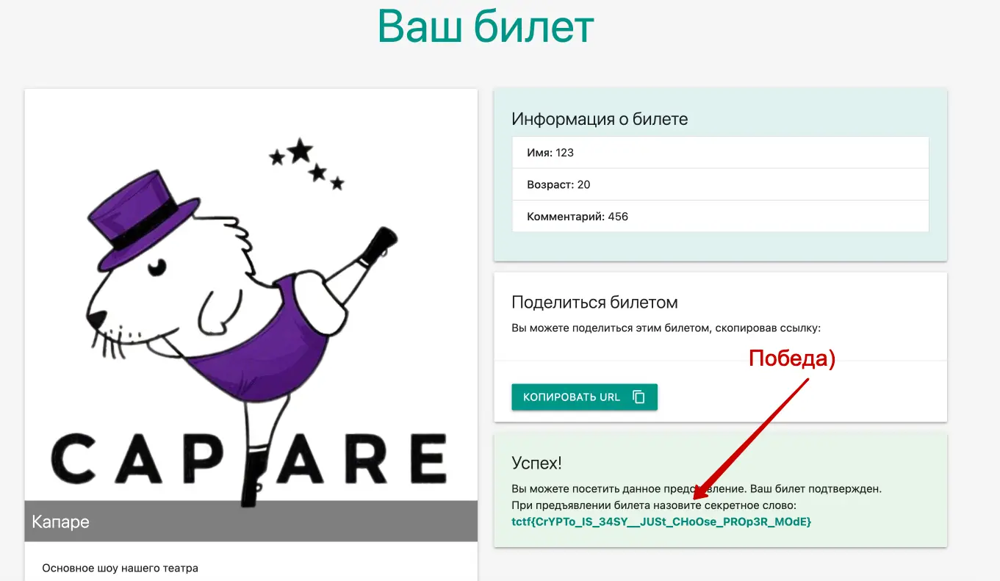

#hard #web #crypto 

#### Задача

| Вводные   | Материалы                                                                                                                                                                                                                                                                                                       |
| --------- | --------------------------------------------------------------------------------------------------------------------------------------------------------------------------------------------------------------------------------------------------------------------------------------------------------------- |
| Исходники | Исходники бекенда сайта: [caparet.tar.gz](./assets/caparet.tar.gz)                                                                                                                                                                                                                                              |
| Сайт      | https://t-caparet-sqxnnkee.spbctf.org/                                                                                                                                                                                                                                                                          |
| Условие   | Недавно в Капибаровске открылся театр-капаре. На входе поставили умные турникеты: они пропускают только гостей старше 18 лет. Но программа начала сбоить, а маленькие капибарята — проникать на шоу.  Найдите ошибку в системе турникета, чтобы её исправили. А то мамы-капибары скоро начнут жаловаться. |
| Статус    | 🟢 Решено после CTF                                                                                                                                                                                                                                                                                             |

#### Решение

- Смотрим сайт - тут ничего нет, кроме двух форм бронирования билетов. В одной на взрослое представление, во второй на детское. При бронировании нужно вводить имя, возраст и комментарий. На взрослый сеанс не удается зарегистрироваться старше 18 лет, в детском любой возраст проходит. После регистрации получаем ссылку на представление. На детский открывается, а взрослый нет - не достаточный возраст, должно быть более 18 лет, но ввести этот возраст нельзя.
- Обращаем внимание на ссылку - в ней длинный хеш, значит в нем достаточно много информации хранится или зашифровано чем-то сложным и большим. Пример хеша: 8726e119fdeb2fb5f9c690aa0e2027b4d777c91e7ab9cc8b7ec972617892eb0d3b6f2bcc9a4adde87df4550ce67885e27fd43dad056bd9a8a5ff6161aefa9d52e3579584846a916a88ddb68813fe2b14c6ebc0e09a28b4a8597f7326ac250ccc12d316bd73e7ad53533d1acb50a0c2cf
- Идем в исходники и смотрим, чем кодируется хеш. Скорее всего в нем дело, тем более у задачи тег crypto, это тоже подсвешивает, что задача на какое-то шифрование
- В коде находим файл с методами шифрования и дешефровки. Раз хеш обратим и его можно дешифровать, то в нем точно зашита информация о билете, в том числе и возраст - убеждаемся в этом, проверив остальной код бекенда.
- Гуглим про шифрования AES в режиме ECB. И находим важное примечание, что ECB — самый простой режим шифрования, однако он крайне небезопасен, поскольку одинаковые блоки открытого текста преобразуются в идентичные зашифрованные блоки. Это позволяет атакующему легко распознавать повторяющиеся структуры в исходных данных.
- Получается, что в таком режиме шифрования одни и те же данные имеют одинаковый паттерн хеша - поавторяются куски. Как ломать стало понятно, действуем.
- Генерим две ссылки с разных форм: в детский и взрослый. При регистрации указываем одинаковое имя и одинаковый комментарий, но разный возраст. Одинаковые имя и коммент можно будет выкинуть и останутся только отличая - возраст. Подменим возраст в ссылку на взрослое представление и попоробуем перейти по такой ссылке на сайте
- И действительно, план сработал, пустило на взрослое представление, а там флаг. Победа!

#### Скрины

