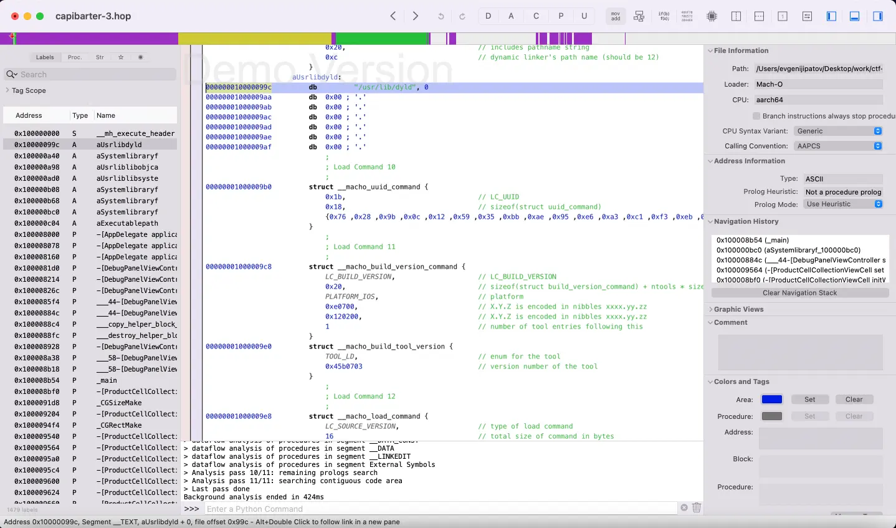
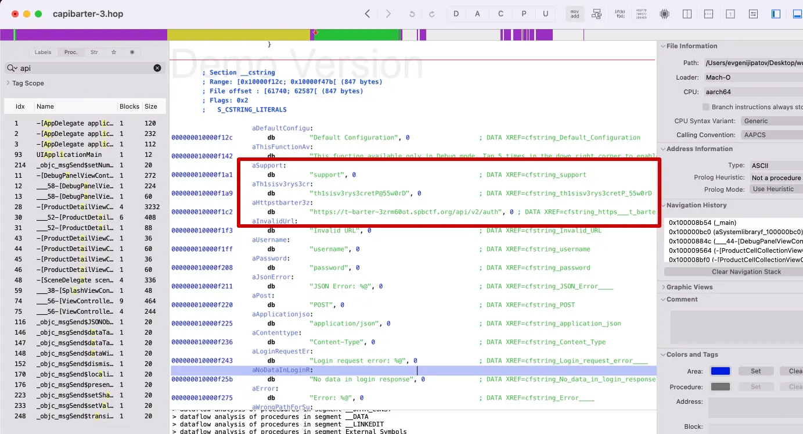
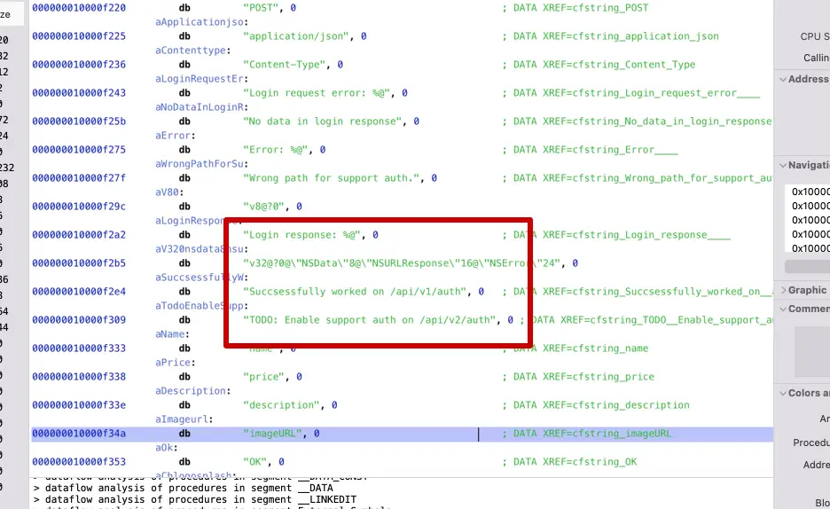
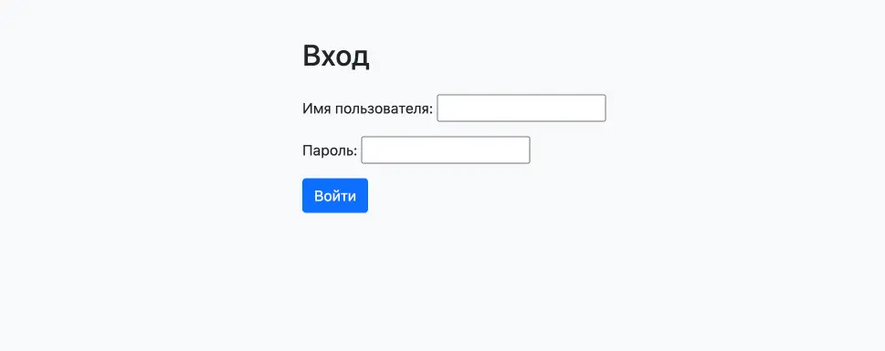
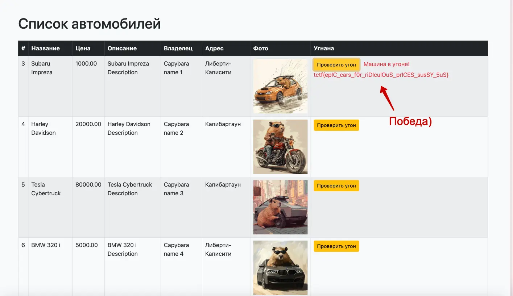

#easy #reverse #web #mobile 

#### Задача

| Вводные   | Материалы                                                                                                                                                                                                                                                                                                  |
| --------- | ---------------------------------------------------------------------------------------------------------------------------------------------------------------------------------------------------------------------------------------------------------------------------------------------------------- |
| Исходники | Приложение на IPhone в формате ipa: [скачать](./assets/capybarter.ipa)                                                                                                                                                                                                                                     |
| Сайт      | Нет                                                                                                                                                                                                                                                                                                        |
| Условие   | На площадке для обмена авто и запчастями Капибартер появились новенькие спортивные машины, которые отдают почти даром. Есть подозрение, что это краденые машины из Либерти-Каписити — и от них хотят поскорее избавиться.  Найдите доказательства, чтобы поймать воров и защитить капибар от обмана. |
| Статус    | 🟢 Решено на CTF                                                                                                                                                                                                                                                                                           |

#### Решение

- Сперва идем гуглить, что за формат ipa и что с ним можно делать. Узнаем, что Файл .ipa — это zip-архив приложений iOS и iPadOS, в котором хранится приложение iOS/iPadOS в формате пакета
- Раз это архив, то его сперва стоит распаковать. Команда unzip capybarter.ipa или через любое приложение архиватор, предварительно поменяв расширение с .ipa на .zip. Получаем папку Payload, внутри которой лежит бинарник capibarter
- Можно попробовать поискать эмулятор iphone для запуска приложения. Но сперва стоит открыть и посмотреть, что там внутри. Файл легкий - 350 КБ, инфы будет не много. Открываем с помощью лайтового приложение 010 Editor – ничего не понятно, нормально не открылось. Открываем через более мощный инструмент дизассемблера IDA Free, эта программа тоже не помогает - говорит, что в бесплатной версии не умеет работать с программами под архитектуру ARM. Гуглим дизассемблеры под arm, находится триал версия Hopper Disassembler, вот этот инструмент уже одалел бинарник и разобрал его как следует - появились хексы и код ассемблера.
- В асме ничего не понятно, но очень интересно. Пробуем поиском по всем файлам найти упоминания tctf и flag – пусто, ничего не находится. Значит данные или зашифрованы или лежат где-то на сервере, к которому обращается приложение. Чтобы понять куда стучится приложение, надо найти хост или эндпоинты, ищем по ключам: http, api, auth и тд
- По "api" находим ссылку на эндпоинт сервера: https://t-barter-3zrm60ot.spbctf.org/api/v2/auth и даже бонус, рядом в ячейках помяти висят перемнные с логином и паролем для саппорта
- Переходим по урлу, но там 404я. Пробуем отправить запросы POST-ом на этот эндпоинт, PUT-ом и другими методами, но ответ всегда 404й. Пробуем брутить урлы и руками приписываем типовые адреса, находится админка по адресу хост/admin. Но с найденными доступами нас туда не пускет.
- Идем снова смотреть бинарник. Находим там коммент с тудухой, что апи v2 еще не работает и рядом есть урл к апихе версии v1. Переходим по этому урлу и натыкаемся на форму входу, но сюда уже подходят доступы саппорта и входим в сервис проверки машин на угон. В первой же проверке нам говорят, что тачка в угоне и выдают флаг. Победа!

#### Скрины

