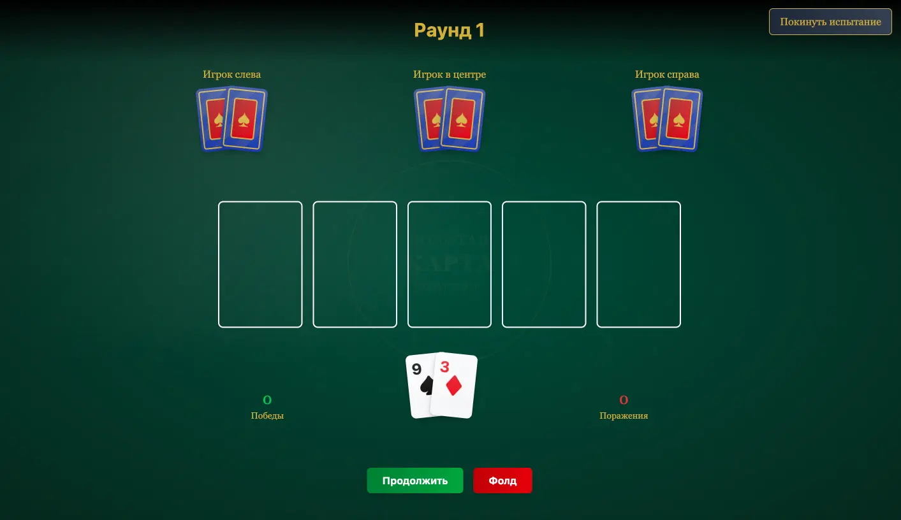
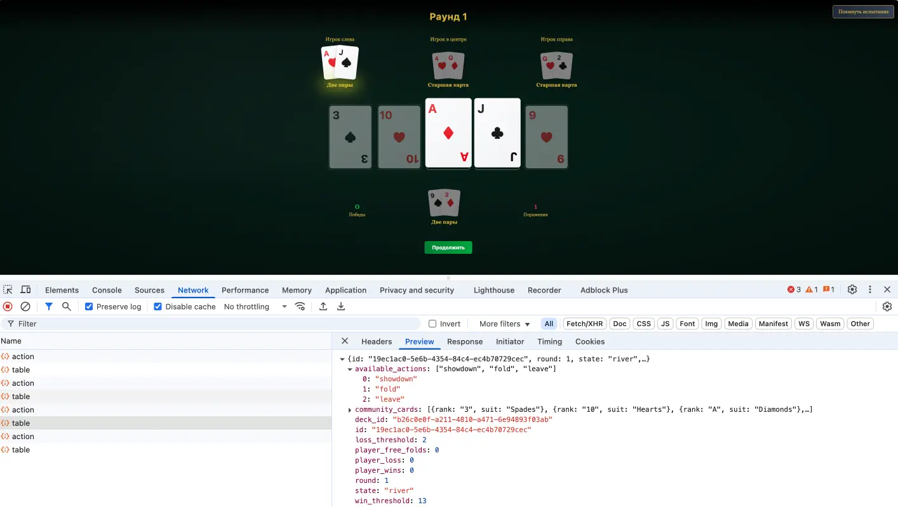
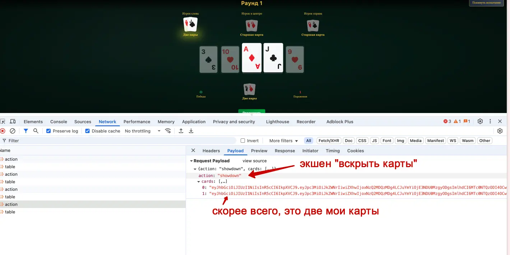
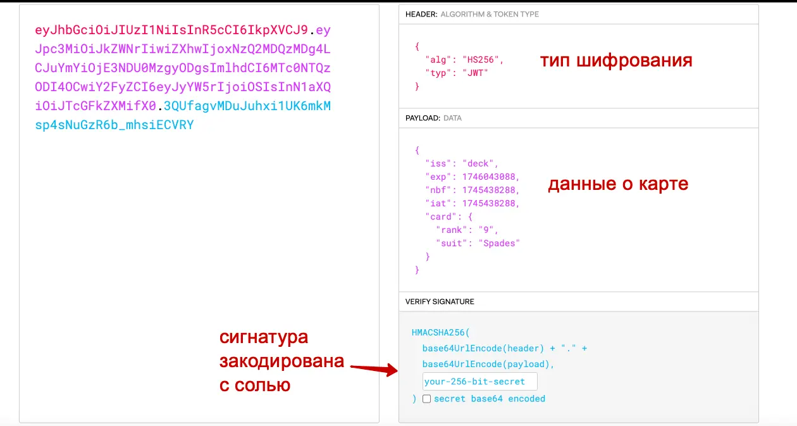
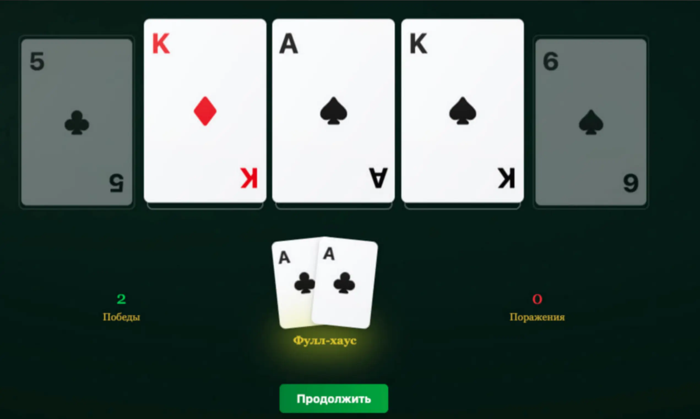

#easy #web

#### Задача

| Вводные   | Материалы                                                                                                                                                                                                                                                                                                                                                                                        |
| --------- | ------------------------------------------------------------------------------------------------------------------------------------------------------------------------------------------------------------------------------------------------------------------------------------------------------------------------------------------------------------------------------------------------ |
| Исходники | Без исходников                                                                                                                                                                                                                                                                                                                                                                                   |
| Сайт      | https://t-bluff-w27iyuba.spbctf.org/                                                                                                                                                                                                                                                                                                                                                             |
| Условие   | На чемпионате города по покеру один из игроков побеждает во всех раздачах. По выражению его мордочки невозможно определить, играет ли он честно.  Недавно он совершил невероятное: прошёл сложнейшее испытание «Золотой карты» три раза подряд. Организаторы утверждают, что сжульничать было невозможно, и игрок — прирождённый талант. Проверьте, так ли это, и повторите его успех.  |
| Статус    | 🟢 Решено на CTF                                                                                                                                                                                                                                                                                                                                                                                 |

#### Решение

- На сайте сходу встречает авторизация, регаемся. Далее попадаем за стол игры в покер с тремя соперниками. Чтобы получить флаг, нужно выиграть 13 раз подряд, можно проиграть или скипнуть партию только 2 раза. После двух промашек, нуно начинать заново всю серию игр.
- Играем полную одну партию и далее смотрим, что в это время происходило в консоле - какие запросы и куда отправлялись. Каждый ход на сервер отправляется экшен с событием и второй запрос каждый раз обновляет состояние стола.
- Находим в запросе с экшеном "вскрыться" пейлоад с отправкой на сервер двух токенов наших карт. 
- По структуре токены очень напоминают JWT, проверяем это - декодируем через онлайн сервис [jwt.io](https://jwt.io/). И понимаем, что действительно, это jwt токен. И токен подписан сигнатурой с секретным ключом. Сам ключ нам не известен
- Пробуем сперва "на дуру" подменить карту в токене, изменив пейлоад на нужные значения. Отправляем такой токен, но запрос не проходит валидацию. Так не работает.
- Пробуем одну карту удалить и вместо нее отправить копию второй - две одинаковые. И успех! Такой запрос проходит без ошибок и сервер принял оба токена карт
- Далее все, что остается, это набрать себе "в рукав" тузов(и других карт) и подсовывать их так, чтобы одержать победу 13 раз подряд
- Можно было напсиать скрипт, который насобирает токенов на полную колоду и будет подкидывать нужные, анализируя стол. Но это долго и проще было руками выписать токены для 5-6 карт разной масти и выиграть самому, подпихивая токены в localstorage через консоль браузера. Токены карт хранились и обновлялись там, при каждой новой партии
- Выигрываем 13 раз подряд и получаем флаг. Победа!

#### Скрины

